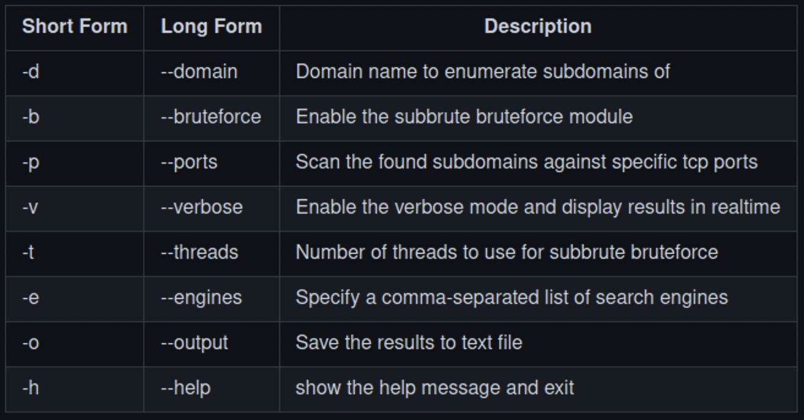

- [Assessment Methodologies: Information Gathering](#assessment-methodologies-information-gathering)
  - [Introduction](#introduction)
  - [Introduction To Information Gathering](#introduction-to-information-gathering)
    - [What is Information Gathering?](#what-is-information-gathering)
    - [What Information Are We Looking For?](#what-information-are-we-looking-for)
  - [Passive Information Gathering](#passive-information-gathering)
    - [Website Recon & Footprinting](#website-recon--footprinting)
    - [Whois Enumeration](#whois-enumeration)
    - [Website Footprinting With Netcraft](#website-footprinting-with-netcraft)
    - [DNS Recon](#dns-recon)
    - [WAF With wafw00f (Detect Firewalls)](#waf-with-wafw00f-detect-firewalls)
    - [Subdomain Enumeration With Sublist3r](#subdomain-enumeration-with-sublist3r)
    - [Google Dorks](#google-dorks)
    - [Email Harvesting With theHarvester](#email-harvesting-with-theharvester)
    - [Leaked Password Databases](#leaked-password-databases)
  - [Active Information Gathering](#active-information-gathering)
    - [DNS Zone Transfers](#dns-zone-transfers)
    - [Host Discovery With Nmap](#host-discovery-with-nmap)
    - [Port Scanning With Nmap](#port-scanning-with-nmap)

# Assessment Methodologies: Information Gathering #

## Introduction ##

**Topic Overview:**
+ Introduction To Information Gathering
+ Passive Information Gathering
+ Active Information Gathering
  
**Learning Objectives:**
+ Learn difference between active and passive information gathering
+ Learn how to perform passing information gathering with various tools and resources
+ Learn active information gathering  

## Introduction To Information Gathering ##

### What is Information Gathering? ###
+ First step of penetration test
  + gathering information on an individual, company, website, system, etc
+ The more information the better
+ Information gathering is broken down into two types:
  + Passive information gathering 
    + Not actively engaging with the target
  + Active information gathering 
    + Gathering information by actively engaging (<r>requires authorization</r>)

### What Information Are We Looking For? ###
**Passive Information Gathering**
+ Identifying IP addresses & DNS information.
+ Identifying domain names and domain ownership information.
+ Identifying email addresses and social media profiles.
+ Identifying web technologies being used on target sites.
+ Identifying subdomains.
  
**Active Information Gathering**
+ Discovering open ports on target systems.
+ Learning about the internal infrastructure of a target 
network/organization.
+ Enumerating information from target systems.

## Passive Information Gathering ##

### Website Recon & Footprinting 
**What are we looking for**
+ IP addresses
  + Can use the `host <Domain(Ex:hackersploit.org)>` command to collect the IP
    + May give multiple IPs which can signify a proxy
    + Can also give a mail server 
+ Directories hidden from search engines
  + Best place to start is `/robots.txt`
    + Will contain directories that they don't want indexed by a search engine 
      + Will have `Disallow: /Director-name/` 
      + crawlers are what search engines use to look through websites to find things it can make searchable
  + Also can look at `sitemap.xml`
    + Gives search engines an organized way of indexing the website
    + Can have a quick route to information, and valid domains to check
+ Names
+ Email addresses
+ Phone Numbers
+ Physical Addresses
+ Web technologies being used
  + Use `BuiltWith` and `Wappalyzer` extension to profile a sites web technologies  
    + Widgets, plugins, frameworks, subdomains 
  + `whatweb` command on kali
    + comes prepackaged with kali
    + Can perform different types of scans by specifying the domain that gets web technologies 
  + `webhttrack` kali app can be used to download an entire website 
    + Some proxies will prevent you from being able to download the whole website 

### Whois Enumeration ###

WHOIS is an internet protocol to query internet resources such as ***domain names*** 
+ `who.is.org` is an online option to do this
+ There is a command line utility where you do `whois <domain(Ex: hackersploit.org)>`
  + Will have name, ID, WHOIS server, when it was created/renewed, when it will expire, registrar abuse email, name server, can see if ***DNS SEC*** is enabled
    + IF DNS SEC is <r>**not**</r> enabled it will show organization, state/province, country, name server, owner
  + Might be able to use a specific IP address for more information or more specific information 
  + CloudFlare will protect a lot of this information if they are being used

### Website Footprinting With Netcraft ###

Will use netcraft to enumerate a lot of information passively 
+ [netcraft data mining](https://www.netcraft.com/internet-data-mining/) will allow a url to be typed at the bottom which will give lots of information about the website 

### DNS Recon ###

This will still be a passive gathering, no zone transfers

`DNSRecon` command line tool is a good start 
+ A python script that can get records such as A, AAAA, txt, MX (Mail), etc
+ `dnsrecon -d <Domain (Ex: hackersploit.org)>`, will pull lots of different records
  + cloudflare does not do well with hiding mail servers as an example 

`DNSdumpster.com` is also very useful
+ Will sort the information much better then dnsrecon 

### WAF With wafw00f (Detect Firewalls) ###

WAF: Web Application Firewall
+ Can be detected with `wafw00f` on the kali CLI
+ can use `wafw00f -l` to see all the firewalls it can detect 
+ Detecting the firewall is very important for the next steps, as it will tell us if the IPs we found with our DNS recon are the actual machines IPs or the firewall proxies
+ Can look at the documentation for more information, for example `wafw00f <domain> -a` will make sure it looks through all the options

### Subdomain Enumeration With Sublist3r ###

Not subdomain brute-forcing, using public available sources of information (OSINT) to find subdomains 
+ Will use search engines, as well as security tools like Virustotal 
+ Also supports brute-forcing, which will be in Active Information Gathering section 
+ See instructions on the github: 

+ Will not get complete success as it as it will only look for domains that were previously available 
+ Example: `sublist3r -d hackersploit.org -e google,yahoo`
  + Will cause a lot of Capchas as you will reach a request threshold before you are verified as as user
  + May need to switch to a VPN eventually 
  + If you don't specify a `-e` it will search all engines 

### Google Dorks ###

Also known as google hacking, can identify pertinent information with google search filters
+ Include subdomains, file types, etc

Can limit the domain with the `site:` search filter 
+ Ex: `site:ine.com`
+ Will help identify sub domains 

Limit within the url with the `inurl:` search filter
+ Ex: `inurl:Admin`
+ Can help find specific pages 

Enumerate subdomains with `site:*.NAME.com`
+ Will show subdomains for the domain
+ These are exposed by choice, but there could be a mistake 

Specify type of file with `filetype:`
+ Example `filetype:pdf` for pdfs

Can also pair these with a normal keyword 
+ Ex: `site:ine.com employees`

`intitle:index of` is a common vulnerability that exposes contents of a directory 
+ Will pick up some other things as well

To see what a website used to look like use `cache:`
+ Ex: `cache:ine.com`

***[waybackmachine](https://archive.org/web/)*** site or `archive.org`
+ Shows snapshots of websites at a certain point in time 
+ Sometimes with an older version of the site, it will have sensitive information that is thought to be deleted 
  + email addresses, content information, etc

Check if a website exposed a directory with passwords via `inurl:auth_user_file.txt` or `inurl:password.txt`

***[Google Hacking Database](https://www.exploit-db.com/google-hacking-database))*** or  is a repository for good dorking payloads 

### Email Harvesting With theHarvester ###

Works similar to sublist3r that will use public information (OSINT) for recon. 
+ Gathers emails, names, subdomains, IPs, and URLs

Use via the kali command line
+ `theHarvester` command can be used for help
+ `theHarvester -d hackersploit.org -b google,linkedin` will look through hackersploit.org with exposed info on the specified sites
  + can also remove the .org and just search through everything on hackersploit
+ More sites to use can be: `google, linkedin, yahoo, dnsdumpster, duckduckgo, crtsh, rapiddns`
+ `spyse` search engine is very good but does need a subscription 

### Leaked Password Databases ###

Can use email address previously identified to see if the owner experienced a data breach
+ Can then utilize that password to preform a password spray attack

A good site is [Have I Been Pwned](https://haveibeenpwned.com/)
+ Aggregates data breaches to see if it has been leaked
+ They also have an <o>***API***</o>

## Active Information Gathering ##

### DNS Zone Transfers ###

DNS
+ Resolve domain names to IP addresses
+ Cloudflare (1.1.1.1), Google (8.8.8.8)
+ Contain the records of almost all domains on the internet 

DNS Records 
+ A - Resolves a hostname or domain to an IPv4 address
+ AAAA - Resolves a hostname or domain to an IPv6 address
+ NS - Reference to the domain nameserver
+ MX - Resolves a domain to a mail server
+ CNAME - Used for domain aliases 
+ TXT - Text record
+ HINFO - Host information 
+ SOA - Domain Authority 
+ SRV - Service records
+ PTR - Resolves an IP address to a hostname 

DNS Interrogation 
+ The process of enumerating DNS records for a specific domain 
+ Objective of a DNS interrogation is to prob a DNS server for DNS records for a specific domain 
+ This process can provide with important information such as:
  + IP address of a domain, subdomain, mail server addresses, etc.

DNS Zone Transfer
+ DNS server admins may want to copy or transfer zone files from one DNS server to another 
  + Known as a ***zone transfer***
+ If misconfigured or left unsecured, this can be abused by attackers to copy the zone file from the primary DNS server to another DNS server
+ DNS Zone transfer can provide penetration testers with a holistic view of an organization's network layout
+ Furthermore, internal network addresses may be found on an organizations DNS server

[ZoneTransfer.me](https://digi.ninja/projects/zonetransferme.php) is a good tool to learn zone transfers
+ Looking at [dns dumpster](https://dnsdumpster.com/), can see records of different record types 
+ Does not give a lot of information, neither does `dnsrecon`

`dnsenum` can enumerate the records that are publicly available, and be used to preform a DNS transfer or a DNS bruteforce.
+ Perform a DNS zone transfer with `dnsenum <domain (ex: zonetransfer.me)>`
  + will also preform a DNS enum automatically 

Can also do a dns zonetransfer with `dig`
+ `dig axfr @<nameserver (ex:@nsztm1.digi.ninja)> <domain name (ex: zonetransfer.me)>` 

Before dns, the host file will contain a list of host names and IP addresses 
+ `sudo vim /etc/hosts`
+ A local DNS server of sorts (but not really)

***NOTE:*** the name servers can be obfuscated to a proxy like cloudflare that will prevent DNS transfers

`fierce` is also a good scanner, a precursor to nmap, nessus, etc
+ Can locate likely targets and utilizes DNS 
+ Some internal networks will leak internal access space
+ Can bruteforce with `fierce -dns zonetransfer.me`
  + can look more for subdomains 

### Host Discovery With Nmap ###

First order of business is to discover all devices no that network
+ Will find my IP with `ip a`
  + Can see the IP, subnet
+ Can see reference for nmap with `man nmap`
+ `sudo nmap -sn <subnet/netbits>` will not do a port scan, can scan for hosts (ping scan/sweep)
  + Will also provide the MAC
+ can also use `netdiscover` which works by sending arp requests
  + Ex: `sudo netdiscover -i eth0 -r 192.168.2.0/24`

### Port Scanning With Nmap ###

identify open ports and services

Default tcp nmap scan: `nmap 10.3.18.47`
+ The problem is that it uses the top 1000 most common ports and will first check if it responds to ping, which are ICMP request and they are often blocked
  
nmap scan without ping: `nmap -Pn 10.3.18.47`

nmap scan with all ports: `nmap -Pn -p- 10.3.18.47`

nmap can scan specific ports: `nmap -Pn -p 80 10.3.18.47`
+ or multiple ports: `nmap -Pn -p 80,455,3389 10.3.18.47`
+ or a range `nmap -Pn -p 1-1000 10.3.18.47`

nmap has a fast scan that only scans the top 100 ports with -F: `nmap -Pn -F 10.3.18.47`

nmap can do a udp port scan with -sU: `nmap -Pn -sU 10.3.18.47`

nmap can be more verbose with `-v`

Service version detection can be done with `-sV`
+ Allows us too look for specific vulnerabilities based on the version

Operating system detection scan with `-O`
+ Not always accurate, will usually give a range

Obtain more information with default nmap script scan with `-sC`
+ Runs a list of nmap scripts on the open ports to enumerate more information
+ Will also give information like favicon, methods, server header, title, etc. It will depend on the service running 

Aggressive scan will combine `-sV`, `-O`, -`sC`. denoted by `-A`

Can change speed of  a scan with timing templates `-T0` to `-T5`
+ also describes as `-T paranoid|sneaky|polite|normal|aggressive|insane`

Can output into a file with `> filename.txt`
+ `oN` will be a normal format 
+ `oX` will be xml formal 

