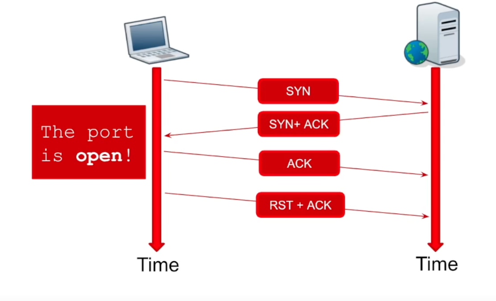
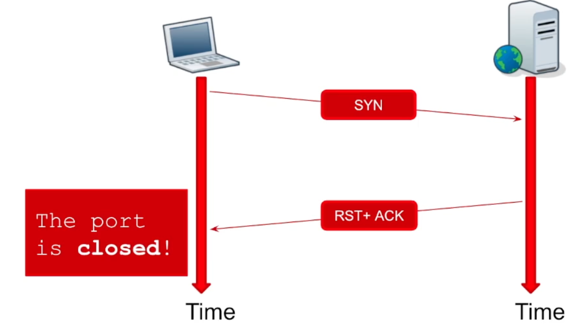
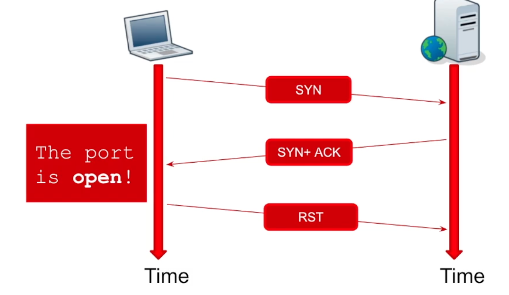

- [Assessment Methodologies: Footprinting & Scanning](#assessment-methodologies-footprinting--scanning)
  - [Introduction](#introduction)
  - [Lessons](#lessons)
    - [Mapping a Network](#mapping-a-network)
      - [Tools](#tools)
    - [Port Scanning](#port-scanning)
      - [NMAP](#nmap)
      - [Other Tools](#other-tools)
  - [Exercises](#exercises)
    - [NMAP Host Discovery](#nmap-host-discovery)
    - [Zenmap](#zenmap)
  - [Challenges](#challenges)
  - [Conclusion](#conclusion)

# Assessment Methodologies: Footprinting & Scanning #

## Introduction ##

Topics 
+ Mapping a Network 
+ Port Scanning 

Learning Objectives 
+ Understand purpose of network mapping and port scanning 
+ Perform network host discovery and port scanning 

## Lessons ##

### Mapping a Network ###

+ <o>Purpose</o>
  + **Scope** 
  + **Discovery**
  + Will need to determine where we are most useful without interference with business. 
+ <o>Process</o>
  + **Physical Access**
    + Physical security 
    + OSINT
    + Social Engineering
  + **Sniffing** 
    + Passive Reconnaissance
    + Watch network traffic
  + **ARP**
    + Resolve IP to MAC, who has IP? I have IP!, then the arp table is updated
  + **ICMP**
    + Internet Control Message Protocol 
    + Traceroute 
    + Ping
      + type 8 - echo request 
+ <o>Tools</o>
  + **WIRESHARK**
  + **ARP-SCAN**
  + **PING**
  + **FPING**
  + **NMAP**
  + **ZENMAP**

#### Tools ####

Opening wireshark, can collect traffic on eth0 (can see devices we found in statistics>endpoints)
+ to generate some traffic, can use  <g>ARP-SCAN</g>
  + `sudo arp-scan -I INTERFACE -g IP/SUBNET`
    + where `-I` means interface, and `-g` means generate

+ Can also use <g>PING</g> to check for responses 
  + `ping 10.211.55.2`
    + Will either get responses, or have packet lost

+ <g>fping</g> will send pings to multiple hosts at the same time, and have a clean return 
  + `fping -I INTERFACE -g IP/SUBNET -a`
    + where `-I` means interface, and `-g` means generate and `-a` means alive, or checking if the host is up
  + can redirect errors with `2(which is the error type)> FILENAME`

<r>Sometimes ARP will find what ping cant and vice-versa</r>

+ <g>nmap</g> is very powerful, will use ARP, TCP, etc to scan
  + `nmap -sn IP/SUBNET` (where `-sn` disables port scanning)

+ <g>Zenmap</g>  is a GUI version of nmap 

### Port Scanning ###

+ <o>Purpose</o>
  + Identify OS
  + Identify Services
  + What are we looking at, what vulns?
+ <o>Process</o>
  + Reveal signatures and compare with databases
  + Services might reveal them
  + Will attempt to connect to the ports
    + can use TCP: 
    + 
    + 
    + Can also use TCP "***Stealthy***"
    + 
      + less stealthy now
  + To get Service Version with TCP, after the three way handshake, the server will send the `banner`, and then the attacker will sent a `RST+ACK`
    + Very loud
  + Can also connect to UDP
    + Slower
    + Open | filtered
    + Can be sped up with certain flags
+ <o>Tools</o>
  + <g>NMAP</g>

#### NMAP ####

Lots of different flags and options 
+ Can check them with `nmap -h`

Can specify a list of hosts in a file with `nmap -iL LISTNAME`
+ Will use simple scan to see if ports are open 
+ can add a `-sV` for service detection
+ `-O` for operating system detection 
+ and use `sudo` for a stealth scan
+ Can add in default scripts with `-sC`
  + Based on services it finds so it will take longer 

#### Other Tools ####

+ Zenmap - GUI NMAP
+ NMAP Automator
+ Masscan (fast)
+ Rustscan (fast)
+ Autorecon (similar to NMAP automator )

## Exercises ##

### NMAP Host Discovery ###

1. Can start with a ping to see if it is up: `ping IP`
2. if no response, can also do an arp-scan: `arp-scan -g IP`
3. Can also do an nmap scan with: `nmap IP`,
   + can also do no host discovery with `-Pn`
4. Now can throw on `-sV`, `-O`, `-sC`, etc

### Zenmap ###

Same as NMAP but with a GUI

## Challenges ##

***Notes***:
+ can run a udp scan with version detection using `sUV`
  + or version detection and scripts with `-sUVC`
+ ISC Bind is a dns service
+ Can check TFTP by using `tftp <IP> <PORT>`
  + Then do `> status`

## Conclusion ##

Can block arp and ping, or change standard ports to harden a server 

