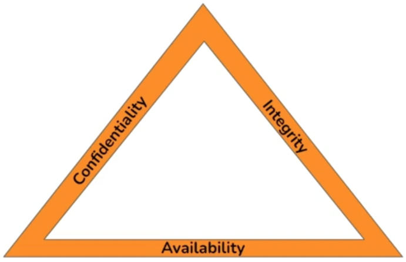
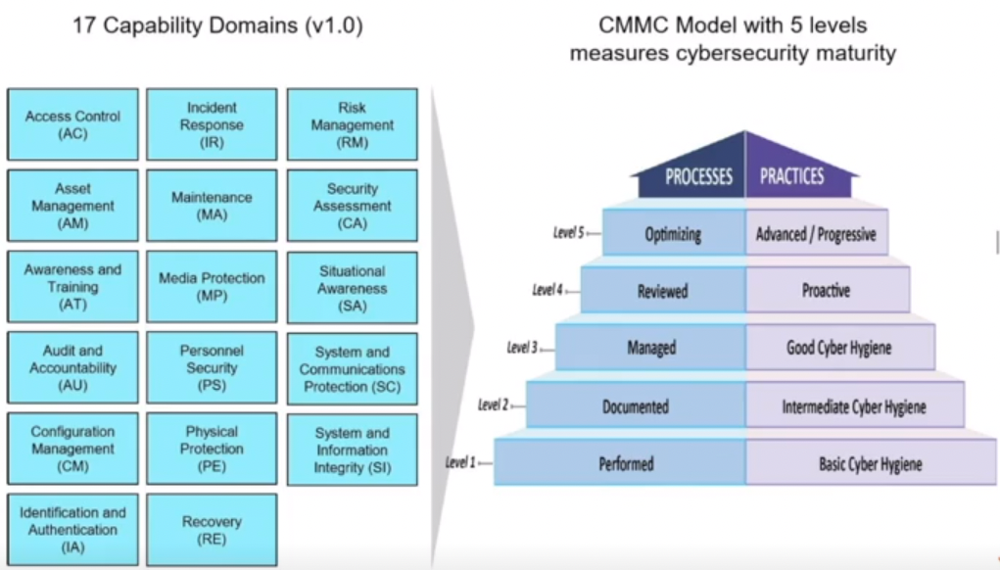
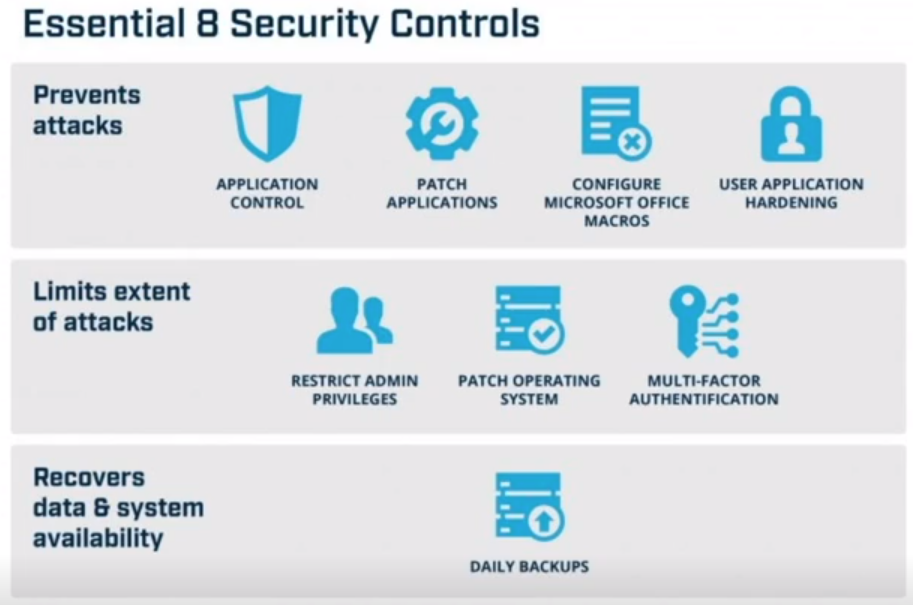

- [Assessment Methodologies: Auditing Fundamentals](#assessment-methodologies-auditing-fundamentals)
  - [Introduction](#introduction)
  - [Auditing Fundamentals](#auditing-fundamentals)
    - [Cybersecurity Basics](#cybersecurity-basics)
      - [What is Cybersecurity?](#what-is-cybersecurity)
      - [CIA Triad](#cia-triad)
      - [Defense in Depth](#defense-in-depth)
    - [Compliance](#compliance)
      - [Regulations](#regulations)
    - [Frameworks and Maturity](#frameworks-and-maturity)
      - [Frameworks](#frameworks)
    - [Auditing](#auditing)
  - [Practice](#practice)
    - [SCAP Scan and Stigviewer](#scap-scan-and-stigviewer)
    - [Nmap](#nmap)
    - [Nessus](#nessus)

# Assessment Methodologies: Auditing Fundamentals #

## Introduction ##

Topic Overview:
+ Cybersecurity Basics
+ Frameworks and Compliance 
+ Cyber Maturity 
+ Auditing 
+ Labs
  + SCAP/STIGs
  + Nessus
  + Nmap 

Learning Objectives 
+ Will describe cybersecurity 
+ Will identify common frameworks and governing regulations 
+ Will explain cyber maturity 
+ Will perform network auditing 

## Auditing Fundamentals ##

### Cybersecurity Basics ###

#### What is Cybersecurity? ####
+ What are we securing?
  + Personally Identifiable Information 
  + Healthcare Information 
  + Financial Data 
  + Intellectual Property 
  + Business Secrets 
  + Business Operations
+ Securing from whom?
  + Criminals 
  + Competitors 
  + Insider Threats 
  + Malicious Actors 

#### CIA Triad ####

A triangle that fluctuates with the needs of the organization  
+ Must have a balance to meet business needs 

<o>Confidentiality</o>
+ For your Eyes only 
+ only shared with who you see fit 

<o>Integrity</o>
+ Only Authorized Changes 
+ What is saved, sent, etc matches what you did  

<o>Availability</o>
+ Cyber information and resources still has to do its job 
+ Cant be so secure that it is not functional 

#### Defense in Depth ####
+ Need to have ***layers*** of defense 
+ Like a castle, will have layers of locks, walls, protections, etx
+ All dependent on the Business Needs
  + Comes down to Risk Management: 
  + How much does it cost for it to be protected vs not protected

### Compliance ###

Sometimes companies are not allowed to "accept the risk" do to certain regulations 
+ Could be fined or unable to operate without them 

#### Regulations ####
+ <b>PCI DSS</b>
  + `Payment Card Industry Data Security Standard`
  + Mandated by card brands
  + Administered by th Payment Card Industry Security Standards Council 
  + Created to increase controls around cardholder data to reduce credit card fraud
+ <b>HIPAA</b>
  + `Health Insurance Portability and Accountability Act of 1996`
  + Us regulations for the use and discolsure of Protected Health Information (PHI)
  + The Final Rule on Security Standards was issued on February 20, 2003
  + Standards and specifications:
    + Administrative Safeguards 
    + Physical Safeguards 
    + Technical Safeguards
+ <b>GDPR</b>
  + `General Data Protection Regulation`
  + Data protection and privacy law in the European Union (EU) and the European Economic Area (EEA)
  + Controllers and processors or personal data must be in place appropriate technical and organizational measures to implement the data protection principles 
+ <b>CPPA</b>
  + `California Consumer Privacy Act`
  + Intended to enhance privacy rights and consumer protection for residents of California, Unites States
  + Companies that become victims of data theft or other data security breaches can be ordered in civil class action lawsuits to pay statutory damages
  + Liability may also apply in respect of business in overseas countries who ship items into California  
+ <b>SOX</b>
  + `Sarbanes-Oxely Act of 2002`
  + Use federal law mandates certain practice in financial record keeping and reporting for corporations 
  + Requires strong ***internal control processes*** over the ***IT infrastructure*** and ***applications*** that house the ***financial information*** that ***flows into its financial reports*** in order to enable them to make ***timely disclosures*** to the public ***if a breach were to occur***

### Frameworks and Maturity ###

#### Frameworks ####
Organizations have put together frameworks that are either required, or a good option to use 

+ <pu>ISO/IEC 27000</pu>
  + `International Organization for Standardization and the International Electrotechnical Commission`
  + Deliberately broad in scope 
  + Covering more than just privacy confidentiality and IT/technical/cybersecurity issues
  + Applicable to organizations of all shapes and sizes
  + Broken down into the following:
    + ***ISO/IEC 27001***
      + Information technology - Security Techniques - Information security management systems - Requirements
      + This is the guidelines  
    + ***ISO/IEC 27002***
      + Code of practice for information security controls
      + How to actually implement 
+ <pu>COBIT</pu>
  + `Control Objectives for Information and Related Technologies`
  + Created by ISACA for information technology (IT) management and IT governance 
  + Business focused and defines a set of generic processes for the management of IT
+ <pu>NIST</pu>
  + `National Institute of Standards and Technology`
  + Catalog of security and privacy controls for all U.S. federal information systems except those related to national security 
  + Agencies are expected to be compliant with NIST security standards and guidelines 
  + NIST Special Publication 800-53B provides a set of baseline security controls and privacy controls for information systems and organizations 
+ <pu>CIS</pu>
  + `Center for Internet Security`
  + Set of 18 prioritized safeguards to mitigate the most prevalent cyber-attacks 
  + A defense-in-depth model to help prevent and detect malware 
  + Offers a free, hosted software product called the CIS Controls Self Assessment Tool (CIS-CSAT)
+ <pu>CMMC</pu>
  + `Cybersecurity Maturity Model Certification` 
  + A training, certification, and third party assessment program of cybersecurity in the United States government Defense Industrial Base (***DOD***)
  + Requires a third party assessor to verify the cybersecurity maturation level
  + Any company working with the ***DOD*** need this 
  + 5 maturity levels:
  + 
    + Based on maturity level, access is granted 
+ <pu>ASD</pu>
  + `Australian Cyber Security Centre Essential Eight Maturity Model`
  + Help organizations protect themselves against various cyber threats
  + Designed to protect Microsoft Windows-based internet-connected networks 
  + 4 maturity levels
    + 

The pentest will lead back to a framework that should be implemented 
+ remediation should be tiered based on severity and up to a framework 

### Auditing ###

Might do an audit because of:
+ Compliance
+ Due Diligence

Audits include:
+ Interviews 
  + determine from the employees security awareness, with lots of different people
+ Review Paperwork 
  + Determine if data and records are secured and available 
+ Assessments 
  + Automated tools like firewalls need to be installed 
  + A scanner like nessus can be used to test these
    + Usefully for pentest
+ Good Notes
  + Markdown, oneNote, etc
  + Turn notes into reports
  + Can also make a mind map
+ Report
  + Not getting paid for pentest, getting paid for the report 

## Practice ##

### SCAP Scan and Stigviewer ###

Security Content Automation Protocol (SCAP) Security Technical Implementation Guides (STIGs)
+ Defense Information Systems Agency (DISA)
+ Guides and Tools for Standardization across organizations 

<r>SCAP</r> tool is how you can check for compliance
+ Can view a summary from a web browser
  + Will also show a score and a color saying how well you did 

Can also view the results with the <r>STIG</r> viewer 
+ Will give an easy way to implement the needed changes 

### Nmap ###

Nmap for asset management is usefull 
+ Will do an internal scan to make sure everything is accounted for 
+ Prevent unwanted assets or hidden assets 
+ May need to take a new inventory 

Can scan a subnet by including the CIDR with the Nmap scan
+ Example: `nmap 192.253.100.0/24`
  + Based on the services running can determine what the servers are and more information 
+ Can run an aggressive scan for the servers found: `nmap 192.253.100.1,3,6 -A`

### Nessus ###

Nessus is a proprietary tool that can do automated scans 
+ free version is a limited IPs a day 
+ Can get reports and a wide variety of scans from it 

