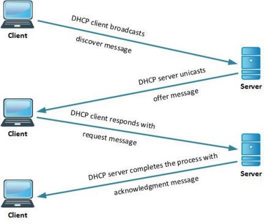

```toc
```
Anything not done will have: TODO

# How to use a sourcetype #

When you are looking for some type of traffic, or a certain description aspect of traffic, can narrow it down with:
+ `sourcetype="SOURCETYPE_NAME"`
+ Example: `sourcetype="pan:log"`

Within a certain source type, can narrow down specifics of the traffic by searching for only certain field values
+ `FIELD_NAME="VALUE"`
+ Example: `action="drop"`

# pan:log #

Palo Alto Network Logs
+ Security logs that come from NGFW
+ Provides insight at the application level
+ `sourcetype="pan:log"`

## Important Fields ##

`source`
+ Will show where the logs are coming from, usually something like `/logs/itsec/pan.log`

`host`
+ Shows what machine is associated with managing the logs

`action`
+ Shows how the NGFW handled the traffic
+ <mark style="background: #BBFABBA6;">Values</mark>:
	+ allow
	+ drop
	+ deny
	+ unknown
	+ reset-both
	+ protocol-anomaly
	+ info-leak
	+ scan

`app`
+ Gives insight about what the application type is, via the NGFW

`bytes_in` and `bytes_out`
+ Gives information regarding the size of the transfer
+ pay attention to deviations from baseline

`date_hour`, `date_mday`, `date_minute`, `date_month`, `date_second`, `date_wday`, `date_year`, `date_zone`, `start_time`
+ Allows for time specification, will likely not use for the search, but when viewing a log

`dest_location`
+ Will show either the IP range it is going, or the geographic area of the destination

`dest_port`
+ Shows port of destination, will be able to infer service

`dest_translated_ip`
+ The NATed IPv4 or IPv6 address to which a packet has been sent

`dest_translated_port`
+ The NATed port to which a packet has been sent.

`dest_zone`
+ The network zone of the destination
+ The zone it goes into can shed light on the danger of the traffic as well as intention
+ <mark style="background: #BBFABBA6;">Values</mark>:
	+ inside
	+ outside
	+ DMZ_outside
	+ trinity-inside
	+ DMZ_inside

`duration`
+ The amount of time for the completion of the network event, in seconds

`dvc_name`
+ The device that reported the traffic event
+ Can give more information on the source

`log_subtype`
+ Gives information about the type of log
+ Will mostly pay attention to `alert`, `deny`, and `sinkhole` for out of the ordinary logs
+ <mark style="background: #BBFABBA6;">Values</mark>:
	+ drop
	+ end
	+ deny
	+ alert
	+ sinkhole

`packets_in` and `packets_out`
+ Gives information regarding the size of the transfer

`rule`
+ Will describe what rule the firewall used for the traffic
+ `Default Outbound` is simple, describing an `action="allow"`
+ Others will give more detail to why the `action` varied
+ <mark style="background: #BBFABBA6;">Values</mark>:
	+ Default Outbound
	+ FireHol - Level 1 - Block IN
	+ Rule 101
	+ Implicit-DMZ-IN-OUT
	+ dns `for dns traffic`
	+ Rule 4
	+ Rule 126
	+ interzone-default
	+ Rule 129
	+ Rule 2

`session_end_reason`
+ Why the session ended, most if it will be a normal policy-deny, aged-out, or a specific tcp type ending
+ Watch out for `threat`
+ <mark style="background: #BBFABBA6;">Values</mark>:
	+ policy-deny
	+ aged-out
	+ tcp-rst-from-server
	+ tcp-fin
	+ tcp-rst-from-client
	+ <mark style="background: #FF5582A6;">NOTE</mark>: a Nmap TCP SYN (Stealth) Scan (-sS), or more commonly a sudo scan, uses this method to be more stealthy. Keep that in mind when seeing that traffic

`splunk_server`
+ Will say what Splunk server is being used, going to be all cloud now

`src_ip`
+ The ip address of the source

`src_location`
+ Will show either the IP range it is going, or the geographic area of the source

`src_port`
+ The source port of the network traffic.
+ These will usually be ephemeral (temporary), and do not mean much

`src_translated_ip`
+ The NATed IPv4 or IPv6 address to which a packet is from

`src_translated_port`
+ The NATed port to which a packet is from

`dest_zone`
+ The network zone of the source
+ The zone it goes into can shed light on the danger of the traffic as well as intention
+ <mark style="background: #BBFABBA6;">Values</mark>:
	+ inside
	+ outside
	+ DMZ_outside
	+ trinity-inside
	+ DMZ_inside

`traffic_flag`
TODO

`transport`
+ The OSI layer 4 (transport) or internet layer protocol of the traffic observed, in lower case.
+ <mark style="background: #BBFABBA6;">Values</mark>:
	+ tcp
	+ udp
	+ icmp `Note: this includes pings, could be scanning`

`src_user`
+ can see the username associated with the source traffic
+ for us thats the NETID

`dest_user`
+ can see the username associated with the dest traffic
+ for us thats the NETID

# WinEventLog #

Windows Event Logs
+ in-depth record of events related to the system, security, and application stored on a Windows operating system

## Important Fields ##

`Accesses`
+ Will describe was done to an object that was requested
+ Will have an event code of 4656 and 4661
+ <mark style="background: #BBFABBA6;">Values</mark>:
	+ DELETE
	+ ReadData (or ListDirectory)
	+ READ_CONTROL

`action`

+ Describes the result of an event code
+ Will need to know the event code with the action to determine what exactly happened
+ <mark style="background: #BBFABBA6;">Values</mark>:
	+ success
	+ logoff
	+ failure
	+ modified
	+ allowed
	+ lockout
	+ Very often associated with event code 4740

`Application_Name`
+ Shows what process/.exe is running

`authentication_method`
+ Shows how authentication was done
+ Kerberos and NTLM is the usual type

`body`
+ Information about the event that happened
+ Will be your main reading when parsing the packets

`category`
+ more detail on the event, though other sources are better for this

`change_type`
+ The process that the event takes, for usually a log on/off process, normally AAA
+ an audit type will normally point to a group type change

`Client_Address`
+ Address of the client

`Client_port`
+ Usually ephemeral

`ComputerName` and `dest`
+ Name of the computers

`dest_port` and `Destination_Port`
+ destination port
+ Will point to what application the traffic is

`Destination_Address`
+ IP address of the destination

`Direction`
+ Where the traffic originates from, usually Inbound

`Error_Code`
+ https://learn.microsoft.com/en-us/microsoft-365/security/defender-endpoint/event-error-codes?view=o365-worldwide
+ Can read the above link and see more information about what the error was
+ will have to convert from hex

`EventCode`
+ The most important field, describes the exact event
+ https://www.ultimatewindowssecurity.com/securitylog/encyclopedia/

`EventType`
+ https://learn.microsoft.com/en-us/windows/security/threat-protection/auditing/event-4624
+ Can see what each number relates to

`Group_Name`
+ Points to what group the event is associated with
+ Will be something like administrator, users, guests, etc

`Logon_Account`
+ Very important, tells what user is responsible for the event

`Message`
+ the guts of the event, will read this to determine what happened

`Privileges`
+ Points to the privileges associated with the event

`process_exec`
+ The specific exec related to the event

`severity_id`
+ https://learn.microsoft.com/en-us/windows/win32/eventlog/event-identifiers
+ Information about the importance of an event
+ see type for easier use

`Source_Address`
+ The primary way to see source ip

`Source_Port`
+ The primary way to see source port

`Source_Workstation`
+ Name of the workstation

`transport`
+ transport type
+ usually TCP or UDP

`type`
+ will point to the type of event that happened
+ <mark style="background: #BBFABBA6;">Values</mark>:
	+ Information
	+ Not persistent
	+ Active Directory Domain Services
	+ Value Deleted
	+ Value added
	+ Warning
	+ Error

`user_obj_email`
+ Will give the full email, all though this can be surmised from the user

# infoblox:dhcp #

Infoblox
+ platform for automating DNS, DHCP and IPAM (DDI)—and simplifying complex, dynamic network services

DHCP
+ This specific source type collects DHCP logs
+ Dynamic Host Configuration Protocol (DHCP) is a client/server protocol that automatically provides an Internet Protocol (IP) host with its IP address and other related configuration information such as the subnet mask and default gateway
+ DHCP process:


+ This is important to keep in mind when analyzing traffic

## Important Fields ##

`action`
+ Specifies if the dhcp request type was <mark style="background: #ADCCFFA6;">added</mark> or <mark style="background: #ADCCFFA6;">blocked</mark>
+ Usually a `DHCPREQUEST`, `DHCPACK`, or `DHCPDISCOVER` dhcp_request

`action_blocked`
+ Shows the blocked reason
+ <mark style="background: #BBFABBA6;">Values</mark>:
	+ rejected
	+ DHCPNAK
	+ A negative acknowledgment (DHCP server denied a acknowledgment)
	+ DHCPDECLINE
	+ The client is declining an IP offer, usually because it knows the IP exists elsewhere

`dest` and `dest_ip`
+ Destination IP

`dest_hostname`
+ Host name of dest

`dest_mac`
+ mac of dest

`dhcp_type`
+ A very important indicator about the type of traffic
+ Will need to keep in mind the DORA process
+ <mark style="background: #BBFABBA6;">Values</mark>:
	+ DHCPDISCOVER
	+ Discover : Client -> Server
	+ DHCPOFFER
	+ offer : Server -> Client
	+ DHCPREQUEST
	+ request : Client -> Server
	+ DHCPACK
	+ acknowledgment : Server -> Client

`infoblox_host` and `infoblox_ip`
+ Host IP of the DHCP server

`lease_duration`
+ Insight on how long the lease is

`state`
+ says what happens with the lease
+ <mark style="background: #BBFABBA6;">Values</mark>:
	+ Renewed
	+ Issued
	+ Freed
